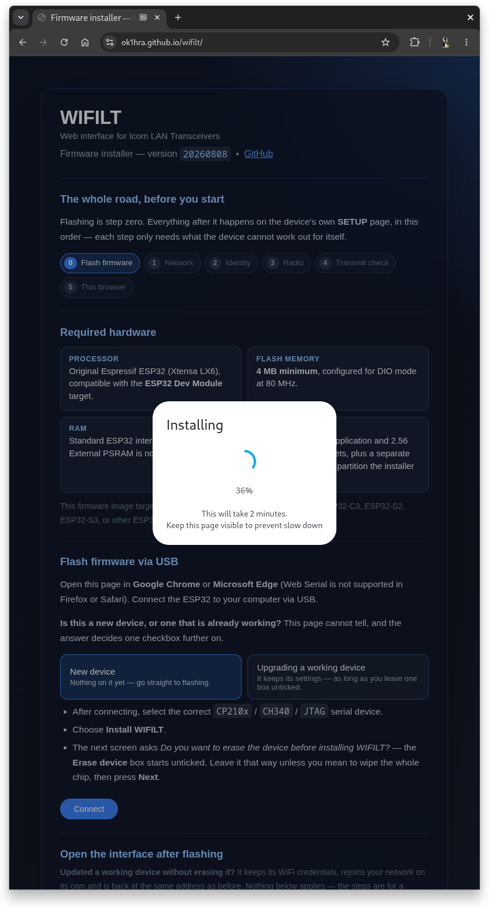
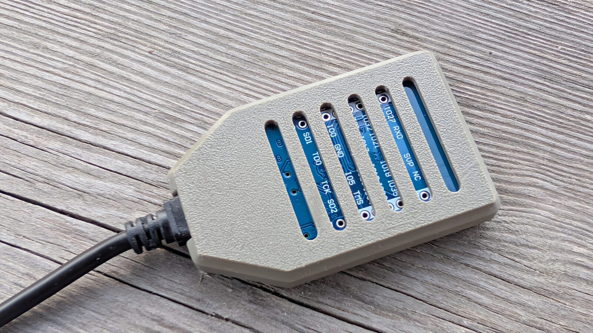

# WIFILT — Hardware Manual

> Icom is a registered trademark of Icom Incorporated. WIFILT is an independent software project
> and is not affiliated with, endorsed by, or sponsored by Icom Incorporated.

This manual covers the hardware WIFILT runs on, the radios it talks to, and how to get the
firmware onto a board. Everything the web interface does once it is running is described in
[SOFTWARE.md](SOFTWARE.md).

## Contents

1. [What you need](#1-what-you-need)
2. [Two hardware paths](#2-two-hardware-paths)
3. [The radio side](#3-the-radio-side)
4. [Flashing the firmware](#4-flashing-the-firmware)
5. [Serial console](#5-serial-console)
6. [Status LED](#6-status-led)
7. [Connectors and wiring](#7-connectors-and-wiring)
8. [POWER-OUT, CI-V OUT and the KEY output](#8-power-out-ci-v-out-and-the-key-output)
9. [Watchdog and automatic recovery](#9-watchdog-and-automatic-recovery)
10. [Enclosures, PCB and bill of materials](#10-enclosures-pcb-and-bill-of-materials)
    · [10.1 A case for a bare ESP32 dongle](#101-a-case-for-a-bare-esp32-dongle)
    · [10.2 The RemoteQTH interface](#102-the-remoteqth-interface)
11. [Running without the ESP32 board](#11-running-without-the-esp32-board)

---

## 1. What you need

**Any ESP32 WROOM module with 4 MB of flash** — if you want the hardware box. It is one of
four ways to run WIFILT, not the only one: the same interface also runs as a native binary
on a **Linux**, **Windows** or **Raspberry Pi** PC, needing no ESP32 at all, when the radio
already has its own network connection. See [section 11](#11-running-without-the-esp32-board).
The rest of this manual, and everything below in this section, is about the hardware route.

A plain ESP32 Dev Module (ESP32-WROOM-32, 4 MB) plugged into USB runs the complete web
interface: the logbook, the DX cluster client, JS8Call, the WSPR beacon, log synchronisation
and the whole SETUP page. No custom board is required.

4 MB is not a recommendation, it is the requirement. The flash is fully spoken for:

| Partition | Size | What lives there |
|---|---|---|
| `nvs` | 20 kB | WiFi credentials, callsign, locator, radio login — survives a firmware update |
| `otadata` | 8 kB | boot selection |
| `app0` | 1.375 MB | the firmware (~1.0 MB, leaving roughly 440 kB of headroom) |
| `cfg` | 128 kB | your configuration: radio slots, LOG and JS8 settings, TX gain calibrations, CW and frequency memories, MSG BOX |
| `spiffs` | 2.5 MB | the web assets — pages, scripts, and the JS8 modem compiled to WebAssembly |

`0x190000 + 0x270000 = 0x400000` exactly: the layout ends precisely at the end of a 4 MB
chip. An 8 MB or 16 MB module works too — the extra flash simply goes unused — but a 2 MB
module cannot hold the assets.

Any WROOM form factor will do: a dev board, or one of the USB-dongle style carriers, for
which there is a printed case in [section 10.1](#101-a-case-for-a-bare-esp32-dongle).

You also need:

- **A radio.** See [section 3](#3-the-radio-side).
- **A browser.** Phone, tablet, laptop or desktop; Android, iOS, macOS, Windows or Linux.
  Nothing is installed on it and nothing needs to reach the internet.
- **A 2.4 GHz WiFi network**, or nothing at all — the device raises its own hotspot when it
  cannot find one.

---

## 2. Two hardware paths

WIFILT runs on a bare module, but some functions need physical outputs a bare module does
not have. The firmware works out which board it is running on at boot and hides what it
cannot do.

| Function | Bare ESP32 WROOM | RemoteQTH interface |
|---|:--:|:--:|
| Web UI: QRPLog, DXC, DATA, SETUP, LOGSYNC | ✅ | ✅ |
| ICOM-LAN — control and bidirectional audio over the network | ✅ | ✅ |
| JS8Call and the WSPR beacon | ✅ | ✅ |
| TrxNet peer-to-peer link to other RemoteQTH devices | ✅ | ✅ |
| CI-V over the serial port | ⚠️ needs your own level converter | ✅ |
| CW keying (sent as a CI-V message to the radio) | ✅ | ✅ |
| RTTY keying (FSK + PTT on GPIO) | ⚠️ bare GPIO, 3.3 V TTL | ✅ isolated |
| Galvanically isolated CI-V output for a PA | ❌ | ✅ |
| POWER-OUT 13.8 V / 0.5 A switched output | ❌ | ✅ |
| Status LED | ⚠️ any LED on GPIO 5 | ✅ |
| Band Decoder (`/bd`) | ❌ | ✅ **rev 04 and later only** |

### How the board identifies itself

A resistor divider on GPIO 34 is read once at boot and turned into a revision number:

| ADC reading | Revision | Notes |
|---|---|---|
| ≤ 150 | 1 | |
| 151 – 406 | 2 | typical raw value 253 |
| 407 – 693 | 3 | typical raw value 560 |
| 694 – 900 | 4 | typical raw value 827 — Band Decoder becomes available |
| above 900 | 99 | no divider fitted, board unidentified — a bare module lands here |

The revision is printed on the serial console at boot (`HW | 4 [827 raw]`) and is also
reported to the web UI. Revision 99 is not an error; it simply means the firmware assumes
no interface hardware is present. The **BD** tab stays hidden in the navigation bar, and
opening `/bd` by hand returns *"Band Decoder is available from RemoteQTH interface HW rev
04"*.

---

## 3. The radio side

WIFILT talks to a transceiver over one of three transports, chosen per radio slot in
`SETUP / Radio`. Up to three radios (TRX1, TRX2, TRX3) can be configured at once, but
**only one of them may use ICOM-LAN**.

### ICOM-LAN — network remote control

The richest connection, and the one the project is built around: control, metering and
**bidirectional audio** over WiFi or Ethernet, with no cable between the interface and the
radio. This is what makes JS8Call and the WSPR beacon possible from a browser.

| Radio | Status |
|---|---|
| **IC-705** | **Tested.** This is the radio the project is developed against. |
| IC-7610, IC-9700, IC-7300MK2, IC-7760 | Expected to work — they provide the same Network Control and LAN AF/IF audio functions and the same CI-V command set — but they have not been verified on the air yet. |

On the radio, enable `Network Control` and set a network user name and password. WIFILT
logs in with those credentials; the radio model is then read back from the radio itself, so
power limits, menu paths and setup guidance follow whichever transceiver actually answered.

### CI-V — the serial control bus

Any Icom with a CI-V jack. Control and metering work; audio does not travel over CI-V, so
the digital-mode pages need the radio's own sound path instead. On a bare ESP32 module you
must supply the CI-V level conversion yourself; the RemoteQTH interface has it, plus a
galvanically isolated CI-V output for a PA or an antenna switch.

### TrxNet — peer to peer

A link to another RemoteQTH device on the same network rather than to a radio directly.
Useful for driving a band decoder or reading frequency from a device that already has the
radio. A TrxNet slot deliberately does **not** energise POWER-OUT.

---

## 4. Flashing the firmware

Firmware is installed straight from a web page — no Arduino IDE, no drivers to hunt down.

1. Connect the ESP32 to the computer with a USB-C cable.
2. Open **<https://ok1hra.github.io/wifilt/>** in a browser that supports Web Serial —
   Chrome, Edge or Opera on a desktop. Firefox and Safari cannot do this, and phones
   cannot either.
3. Press **Install WIFILT** and pick the serial port the board appeared on.
4. The dialog offers an **Erase device** checkbox. What you do with it decides the fate of
   your settings — see below.
5. Wait for the write to finish, then close the dialog. The board restarts on its own.

### The "Erase device" checkbox

| Checkbox | What is written | What survives |
|---|---|---|
| **unticked** (default) | bootloader, partition table, firmware, web assets | your whole configuration: radio slots, LOG and JS8 settings, **every TX audio gain calibration**, CW and frequency memories, MSG BOX — plus WiFi credentials, callsign, locator and the radio's login |
| **ticked** | the entire chip is erased first | nothing — the device comes up as a factory-fresh board in AP mode |

Leaving it unticked is almost always what you want. The configuration lives on its own
`cfg` partition that neither the installer nor the upload scripts ever write to, precisely
so that an update does not cost you calibrations that each took a carrier on the air to
measure.

Tick it when you are moving a board to a different station, when you want to start clean,
or when a previous install left the flash in an unknown state.

> **Your QSO log is never at risk from flashing.** It lives in the browser's database on
> your phone or PC, not on the device. See the LOGSYNC chapter in [SOFTWARE.md](SOFTWARE.md)
> for backing it up.

A belt-and-braces habit before any update: `SETUP` → **Download config**, which saves the
whole configuration as a file you can upload back afterwards.

### Flash mode

If you ever build and flash by hand, the flash mode must be **DIO**, not QIO. The RemoteQTH
interface boards ship a Zbit clone flash chip whose QIO reads are unreliable; a QIO
bootloader leaves the board unable to boot at all. The web installer already does this
correctly. See [BUILD.md](BUILD.md).

---

## 5. Serial console

The USB port is also a diagnostic console. Open it at **9600 baud** and press a key.

9600 is only the default: the console runs at whatever **USB and CI-V serial baudrate** is
set in `SETUP / Radio`, so changing that for a CI-V radio moves the console with it.

| Key | Action |
|---|---|
| `?` | print the status page and refresh it |
| `D` | toggle serial debug output |
| `A` | restart into AP mode (asks `y/n`) |
| `E` | erase the whole EEPROM and restart |
| `L` | configure and test the ICOM-LAN connection: enter `IP user pass`, then `t` to test once, `s` to save and reboot into LAN mode, or `b` to go back |
| `@` | restart the device |

> **`E` and `@` ask twice, and the second question is not a `y/n`.** After `Erase whole
> eeprom? (y/n)` comes `Press E again to erase, any other key aborts` — so a `y` held down on
> the keyboard can never wipe the device. `@` asks for `@` the same way. Both prompts give up
> after 30 seconds and do nothing.
>
> Until REV 20260810 that second question was a `y/n` that meant the opposite of the first
> (`Stop erase?` — `n` went ahead), which protected the operator without telling them.

The `?` status page is the fastest way to find a device whose address you have lost — it
prints firmware revision, detected hardware revision with the raw ADC value, WiFi mode,
both configured SSIDs, signal strength, MAC address, **the IP address**, the TrxNet device
name and peers, and the current frequency and mode.

Note that `A` is the only way back into AP mode once the device has joined a network: the
web UI deliberately has no button for it, because pressing it remotely would strand the
device.

---

## 6. Status LED

The LED is on GPIO 5. Its whole vocabulary:

| Pattern | Meaning |
|---|---|
| Slow fade in and out, continuously | AP mode — the device is showing its own `WIFILT-AP` hotspot |
| Dark | Station mode, waiting for a WiFi network — before the first connection **and after a link is lost** |
| Steady on | Station mode, connected — this is the normal resting state |
| One 100 ms dark pulse | a CW message was just keyed out to the radio |
| Dark for as long as the transmission lasts | an RTTY message is being keyed on the FSK and PTT outputs |

A steadily lit LED is the signal that the device is on the network and ready. If it stays
dark, the WiFi credentials are wrong or neither configured network is on the air; if it
fades, no credentials were ever stored — connect to `WIFILT-AP` and set them.

Because the LED sits lit the whole time WiFi is up, both transmit indications have to be the
other way round: a *gap* in the light rather than a flash. CW gets a pulse because the radio
generates the Morse itself and the interface only hands over the message; RTTY is keyed here,
bit by bit, so the LED stays dark for the whole of it.

Until REV 20260810 the LED was written exactly twice — dark at boot, lit on the first
successful connection — so it went on claiming a link long after WiFi had dropped, and RTTY
had no indication at all.

---

## 7. Connectors and wiring

| Connector | Purpose |
|---|---|
| **13.8 V DC jack** | supply. Consumption is under 1 W. |
| **USB-C** | firmware flashing and the serial console. Can also power the board on its own. |
| **KEY** stereo jack | CW / FSK keying out to the radio |
| **SEND/ALC** stereo jack | PTT / send line and ALC sense |
| **ACC RJ45** | CI-V and the interface signals to the radio |

GPIO assignments, for anyone wiring a bare module:

| Signal | GPIO |
|---|---|
| Status LED | 5 |
| POWER-OUT enable | 4 |
| CI-V mute | 16 |
| Hardware ID divider (analog in) | 34 |
| FSK out (TTL) | 33 |
| PTT out | 32 |
| Band decoder clock / latch / data | 15 / 13 / 14 |

---

## 8. POWER-OUT, CI-V OUT and the KEY output

### POWER-OUT

A switched **13.8 V / 0.5 A** output with its own LED, intended to bring the rest of the
station up when the radio comes up. It follows the state of the TRX1 slot:

| TRX1 connection | POWER-OUT |
|---|---|
| ICOM-LAN, radio logged in | **on** |
| CI-V, radio answering | **on** |
| TrxNet | **off** — a TrxNet slot is a link to another device, not a radio at this station |
| nothing connected | **off** |

The serial console reports every transition (`PWR| ON (LAN)`, `PWR| OFF (CI-V)`).

### Galvanically isolated CI-V output

A second CI-V bus for a PA, an antenna switch or any other CI-V device, isolated from the
radio's own bus so a ground loop in the amplifier cannot reach the transceiver. The
**CI-V mute** line on GPIO 16 restricts this output to frequency messages only, so
debug traffic never reaches the PA.

### KEY — CW and RTTY

The same output serves two modes, chosen by whatever mode the radio is in when a message
is sent:

- **CW**, in `CW` and in `CW-R` — the text is handed to the radio as a CI-V CW message and the
  radio generates the Morse itself. The Status LED gives one 100 ms dark pulse.
- **RTTY**, in `RTTY` and in `RTTY-R` — the interface keys it directly: PTT goes high, waits a
  400 ms lead-in, shifts the FSK line through the 5-bit Baudot code at **45.45 baud with 1.5
  stop bits**, then holds PTT for a 200 ms tail. Mark is the low level, space the high one. The
  Status LED is dark for the whole transmission.

The reverse modes key identically to their upright twins — only the sideband the radio listens
on differs — and **those four are the only modes anything is keyed in**. On phone, in a data
mode (`USB-D`, `LSB-D`) or in `WFM` nothing is keyed, and the interface now says so: before REV
20260811 the request was accepted and silently dropped, so flipping to the reverse sideband to
dodge a birdie transmitted nothing at all while the log recorded the report as sent.

CW and RTTY text comes from the QRPLog macros — see the QRPLog chapter in
[SOFTWARE.md](SOFTWARE.md).

---

## 9. Watchdog and automatic recovery

A hardware watchdog restarts the device if the main loop stops feeding it for **73
seconds**. In normal operation it never fires; if it does, the device comes back on its own
without anyone having to reach the shack.

WiFi loss is handled before it ever gets that far, by an escalating recovery in the
firmware — a targeted reconnect first, then a radio reset, then a restart. Nothing about it
needs configuring.

---

## 10. Enclosures, PCB and bill of materials

### 10.1 A case for a bare ESP32 dongle

A bare module works perfectly well but is awkward to leave lying in the shack. This is a
printed case for the USB-dongle shape of ESP32-WROOM-32 board — the module on a small carrier
with a USB connector at one end — with slots that leave the castellated pads reachable.

- [Case for ESP32 dongle, on Printables](https://www.printables.com/model/1755918-case-esp32-dongle-for-wifilt)

Dongle boards like this come and go, and the one it was drawn around may not be on sale for
long. Check the model page against the board actually in your hand before printing. Nothing
about WIFILT depends on it: the requirement is still **any ESP32 WROOM module with 4 MB of
flash**.

### 10.2 The RemoteQTH interface

The interface board is an open design.

- [Schematic rev3 (PDF)](hw/IC-705-interface-03.pdf)
- [Interactive BOM rev3 (HTML)](hw/IC-705-interface-ibom-03.html)

#### 3D printed enclosure

- [Source rev3 (OpenSCAD)](3Dprint/ic-705-interface-3.scad)
- [rev3 STL](3Dprint/ic-705-interface-3.stl) · [rev3 3MF](3Dprint/ic-705-interface-3.3mf)
- [With mount point rev3 STL](3Dprint/ic-705-interface-3-mountpoint.stl) ·
  [With mount point rev3 3MF](3Dprint/ic-705-interface-3-mountpoint.3mf)

---

## 11. Running without the ESP32 board

If the radio already has its own network connection — Network Control switched on, on an
**IC-705, IC-7610, IC-9700, IC-7300 MK2 or IC-7760** — none of the hardware above is needed.
The same source builds and runs as a native program on a **Linux**, **Windows** or
**64-bit Raspberry Pi** system and reaches the radio purely over IP, serving the identical
pages at the identical address, `http://wifilt.local`. Get it from the
[web installer page](https://ok1hra.github.io/wifilt/) — it offers the ESP32 flash and the
Linux/Raspberry Pi/Windows downloads side by side, each folded until you open the one that is
yours — or build it yourself, see
[BUILD.md § 4](BUILD.md#4-native-build-linux-windows-and-raspberry-pi-arm64).

The trade is symmetric with [section 2](#2-two-hardware-paths): a PC can do everything a bare
ESP32 module does over the network — QRPLog, DXC, JS8Call, the WSPR beacon, TrxNet, LOGSYNC,
ICOM-LAN control and bidirectional audio — but nothing that needs a physical pin. **No CI-V
over a serial wire, no CW/RTTY GPIO keying, no Status LED, no POWER-OUT switched output, and
no Band Decoder.** SETUP works out which build it is talking to from `/setup-data.json` and
hides the controls that would not do anything, the same way it already hides the Band
Decoder tab on a bare module (section 2 above); it also titles itself accordingly —
`WIFILT-LINUX`, `WIFILT-WINDOWS` or `WIFILT-ESP32` — so a box and a desktop binary open in
two tabs stay easy to tell apart.

The Linux archive — Raspberry Pi included, it is the same `install.sh` — installs a `systemd`
unit that is not enabled by default and needs one privileged step redone on every upgrade
(binding ports 80/82/83); the Windows build is a single static `.exe` with nothing to
install. None of them runs unattended the way the ESP32 box does when nothing is plugged into
a keyboard — it is a program on a computer that has to be running, not an appliance.

---

*Building the firmware yourself: [BUILD.md](BUILD.md). Using the web interface:
[SOFTWARE.md](SOFTWARE.md).*
