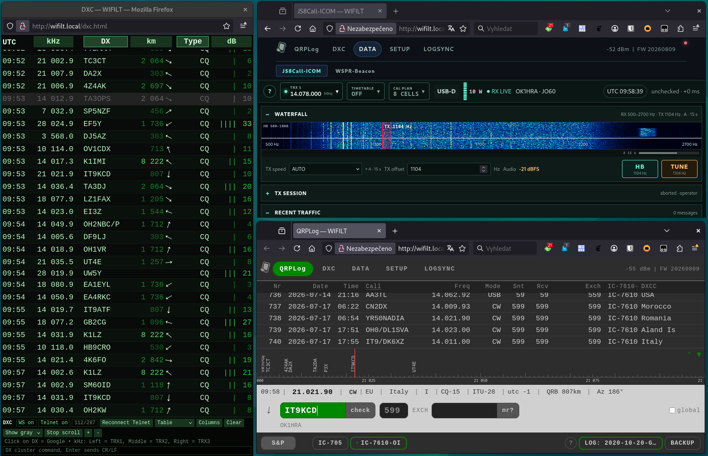

# WIFILT — Web interface for Icom LAN Transceivers

Operate an Icom transceiver from any browser on your network — logbook, DX cluster, JS8Call,
a WSPR beacon and Mercury file transfer — with nothing installed on the phone, tablet or PC,
and no internet.

**Runs on any ESP32 WROOM module with 4 MB of flash — or, if the radio is already on your
network, as a native program on a Linux, Windows or Raspberry Pi PC with no extra hardware at
all.** Get whichever is yours from the web installer page:
**<https://ok1hra.github.io/wifilt/>** (flashing the ESP32 needs Chrome, Edge or Opera on a
desktop, plugged in over USB-C first; the Linux/Raspberry Pi/Windows downloads are plain
archives).

## Manuals

- **[SOFTWARE.md](SOFTWARE.md)** — the web interface: first run, QRPLog, DXC, JS8Call, the
  WSPR beacon, Mercury file transfer, SETUP, LOGSYNC and the band decoder.
- **[HARDWARE.md](HARDWARE.md)** — the ESP32 and the RemoteQTH interface board: which radios
  work, flashing, connectors, Status LED, schematic and 3D-printed case — and, for the
  Linux/Raspberry Pi/Windows route that needs none of it,
  [§ 11](HARDWARE.md#11-running-without-the-esp32-board).

Building from source: [BUILD.md](BUILD.md).

## License

WIFILT is free software, distributed under the **GNU General Public License, version 3 or
later** — see [LICENSE](LICENSE). This repository is the corresponding source for every
binary the project distributes, including the images served by the web installer. The
licences of the individual third-party components are listed in
[SOFTWARE.md § 12](SOFTWARE.md#12-component-licences) and in
[data/THIRD-PARTY-NOTICES.txt](data/THIRD-PARTY-NOTICES.txt).

Icom is a registered trademark of Icom Incorporated. WIFILT is an independent software
project and is not affiliated with, endorsed by, or sponsored by Icom Incorporated.
