# WIFILT — Software Manual

> Icom is a registered trademark of Icom Incorporated. WIFILT is an independent software project
> and is not affiliated with, endorsed by, or sponsored by Icom Incorporated.

This manual describes everything the WIFILT web interface does. For the board it runs on and
how to get firmware onto it, see [HARDWARE.md](HARDWARE.md); for building from source, see
[BUILD.md](BUILD.md).

---

## Contents

**[1. What WIFILT is](#1-what-wifilt-is)**
 · [1.1 Highlights](#11-highlights)
 · [1.2 Standing on other people's work](#12-standing-on-other-peoples-work)
 · [1.3 Which radios](#13-which-radios)
 · [1.4 The navigation bar](#14-the-navigation-bar)
 · [1.5 Where it runs](#15-where-it-runs)

**[2. First run](#2-first-run)**
 · [2.1 AP mode](#21-ap-mode)
 · [2.2 The five steps](#22-the-five-steps)
 · [2.3 Finding the interface later](#23-finding-the-interface-later)
 · [2.4 What is stored where](#24-what-is-stored-where)

**[3. QRPLog](#3-qrplog)**
 · [3.1 Logs: open, create, activate](#31-logs-open-create-activate)
 · [3.2 Exchange types](#32-exchange-types)
 · [3.3 RUN and S&P](#33-run-and-sp)
 · [3.4 Working a station](#34-working-a-station)
 · [3.5 CW and RTTY macros](#35-cw-and-rtty-macros)
 · [3.6 The status bar](#36-the-status-bar)
 · [3.7 Duplicate and partial-call search](#37-duplicate-and-partial-call-search)
 · [3.8 Blocked DXCC](#38-blocked-dxcc)
 · [3.9 The journal and editing a QSO](#39-the-journal-and-editing-a-qso)
 · [3.10 Band map](#310-band-map)
 · [3.11 Radio selection](#311-radio-selection)
 · [3.12 Export and backup](#312-export-and-backup)
 · [3.13 Keyboard shortcuts](#313-keyboard-shortcuts)

**[4. DXC — DX cluster](#4-dxc--dx-cluster)**
 · [4.1 Connecting](#41-connecting)
 · [4.2 The spot table](#42-the-spot-table)
 · [4.3 Filters](#43-filters)
 · [4.4 Working a spot](#44-working-a-spot)
 · [4.5 Views, columns and the toolbar](#45-views-columns-and-the-toolbar)

**[5. DATA — JS8Call over ICOM-LAN](#5-data--js8call-over-icom-lan)**
 · [5.1 What the page is](#51-what-the-page-is)
 · [5.2 Header: radio, frequency, power, session](#52-header-radio-frequency-power-session)
 · [5.3 Waterfall](#53-waterfall)
 · [5.4 TX SESSION](#54-tx-session)
 · [5.5 Message presets](#55-message-presets)
 · [5.6 @APRSIS command builder](#56-aprsis-command-builder)
 · [5.7 APRS-IS gate (IGate)](#57-aprs-is-gate-igate)
 · [5.8 Recent traffic](#58-recent-traffic)
 · [5.9 Stations](#59-stations)
 · [5.10 Stations map](#510-stations-map)
 · [5.11 MSG BOX](#511-msg-box)
 · [5.12 Groups](#512-groups)
 · [5.13 Unattended operation](#513-unattended-operation)
 · [5.14 SETTINGS](#514-settings)
 · [5.15 Timing and diagnostics](#515-timing-and-diagnostics)
 · [5.16 Frequency timetable](#516-frequency-timetable)
 · [5.17 Logging JS8 QSOs](#517-logging-js8-qsos)
 · [5.18 Troubleshooting](#518-troubleshooting)

**[6. DATA — WSPR beacon](#6-data--wspr-beacon)**
 · [6.1 What the beacon does](#61-what-the-beacon-does)
 · [6.2 Starting and stopping](#62-starting-and-stopping)
 · [6.3 Power](#63-power)
 · [6.4 Waterfall and TX SESSION](#64-waterfall-and-tx-session)
 · [6.5 Activity](#65-activity)
 · [6.6 Time table](#66-time-table)
 · [6.7 SETTINGS](#67-settings)
 · [6.8 TX audio gain and CAL PLAN](#68-tx-audio-gain-and-cal-plan)
 · [6.9 Radio setup help](#69-radio-setup-help)

**[7. DATA — Mercury file transfer](#7-data--mercury-file-transfer)**
 · [7.1 What Mercury does](#71-what-mercury-does)
 · [7.2 Header: radio, timetable and CAL PLAN](#72-header-radio-timetable-and-cal-plan)
 · [7.3 Waterfall](#73-waterfall)
 · [7.4 Calling a station, and CQ](#74-calling-a-station-and-cq)
 · [7.5 Connection test and live status](#75-connection-test-and-live-status)
 · [7.6 Sending and receiving a file](#76-sending-and-receiving-a-file)
 · [7.7 A transfer running elsewhere](#77-a-transfer-running-elsewhere)
 · [7.8 SETTINGS](#78-settings)

**[8. SETUP](#8-setup)**
 · [8.1 WiFi](#81-wifi)
 · [8.2 Identity](#82-identity)
 · [8.3 Radio](#83-radio)
 · [8.4 DX Cluster](#84-dx-cluster)
 · [8.5 TrxNet](#85-trxnet)
 · [8.6 TX audio gain](#86-tx-audio-gain)
 · [8.7 LOG](#87-log)
 · [8.8 Remote management of JS8 unattended operation](#88-remote-management-of-js8-unattended-operation)
 · [8.9 Save, download and upload the configuration](#89-save-download-and-upload-the-configuration)

**[9. LOGSYNC](#9-logsync)**
 · [9.1 Where your QSOs live](#91-where-your-qsos-live)
 · [9.2 Pairing and syncing](#92-pairing-and-syncing)
 · [9.3 Sync status](#93-sync-status)
 · [9.4 Backup and restore](#94-backup-and-restore)
 · [9.5 Importing ADIF, Cabrillo and EDI](#95-importing-adif-cabrillo-and-edi)

**[10. BD — band decoder](#10-bd--band-decoder)**

**[11. Transmit safety](#11-transmit-safety)**

**[12. Component licences](#12-component-licences)**

---

## 1. What WIFILT is

WIFILT turns an Icom transceiver into a station you operate from a browser. The interface —
an ESP32 the size of a matchbox, or the same program running natively on a Linux, Windows or
Raspberry Pi PC ([section 1.5](#15-where-it-runs)) — joins your network, logs in to the radio
over Icom's own network protocol, and serves a complete set of operating pages to any phone,
tablet or computer on the network.

Nothing is installed on the client. Nothing goes through a cloud service. The radio can sit
at the antenna, in the car, or on a hill, and you work it from the sofa.

### 1.1 Highlights

**Wireless operation from a tablet or a phone.** The link to the radio is the network, and
it carries control, metering *and audio in both directions*. There is no USB cable to the
computer and no sound card to configure. Put the radio where the antenna is.

**Multiplatform, because it is a web page.** Android, iOS, macOS, Windows, Linux — anything
with a modern browser. No app store, no drivers, no installer, no per-platform version to
wait for.

**Everything runs from the ESP32.** The pages, the JS8 modem, the WSPR encoder, the DXCC
database — all of it is served from 2.5 MB of flash on the interface itself. There is no
server, no account, and **no internet needed**: on a hill with no coverage the whole system
works exactly as it does at home. That is the point of the design, not a side effect.

**A complete JS8Call-compatible modem in the browser.** Decoding and encoding both run as
WebAssembly in the browser tab, driven by real receiver audio streamed from the radio.
Heartbeats, directed messages, store-and-forward mail, groups and an APRS-IS command builder
are all there — and so is unattended operation, where the station answers for you while you
are away. It can also work the other way round and act as an **APRS-IS IGate**, carrying
what other stations address to `@APRSIS` onto the APRS network — see
[section 5.7](#57-aprs-is-gate-igate).

**A WSPR beacon with a real schedule.** Not a "transmit every ten minutes" timer, but a
24-hour band-by-band time table, transmit-percentage pacing, and power taken from what the
radio actually reports.

**A contest logbook that lives in your browser** — instant, offline, and yours. It
synchronises peer-to-peer with the other devices on your network, so the phone in your
pocket and the laptop on the table hold the same log, with no server in between.

**A DX cluster client with a band map**, wired straight into the logbook and the radio: one
click on a spot puts the radio on frequency, and worked stations grey out.

**Up to three radios.** TRX1, TRX2 and TRX3 can be different transceivers on different
transports, switchable from the logbook with a keystroke.

**The radio tells the software what it is.** WIFILT reads the model back from the
transceiver rather than asking you to pick it from a list, so power limits, menu paths and
setup guidance follow whatever is actually connected.

### 1.2 Standing on other people's work

WIFILT would not exist without five open-source projects, and the debt is worth stating
plainly.

**[ESP32 BT CAT for IC-705](https://github.com/ok1cdj/IC705-BT-CIV)** — Ondrej "OK1CDJ". WIFILT
began as a derivative of this project — the header comment at the top of `wifilt.ino` still
says so. The Bluetooth transport it started from is gone (LAN, CI-V and TrxNet only, since
2026-07), but the origin is credited regardless of how much of the original code remains.

**[wfview](https://gitlab.com/eliggett/wfview/)** — Elliott Liggett (W6EL), Phil Taylor
(M0VSE) and contributors. Icom's network control protocol is undocumented. wfview worked it
out and published the result under the GPL: the login passcode transformation, the packet
layouts, the audio streaming, the retransmit logic. Every LAN connection WIFILT makes rests
on that work.

**[JS8Call](http://js8call.com/)** — Jordan Sherer (KN4CRD) — and the
[JS8Call-improved](https://github.com/JS8Call-improved/JS8Call-improved) fork that continues
it. JS8 itself, the protocol, the message grammar, the directed-message conventions and the
compression tables all come from there. WIFILT's modem is that DSP code compiled to
WebAssembly so it can run in a phone browser; the mode, and the community that uses it, are
Jordan's.

**[WSJT-X](https://wsjt.sourceforge.io/)** — Joe Taylor (K1JT) and the WSJT-X team. WSPR is
theirs, and so is the FT8/JS8 modulation heritage underneath everything on the DATA page.
The beacon's encoder is checked against WSJT-X's own golden vectors on every build.

**[Mercury](https://github.com/Rhizomatica/mercury)** — Rafael Diniz and Rhizomatica. Mercury
is a wire-compatible ARQ file-transfer modem built for the same constraint WIFILT itself is
built around — real HF, real noise, no assumption of a clean link — and the Mercury tab on the
DATA page ([section 7](#7-data--mercury-file-transfer)) runs its actual ARQ engine, compiled
to WebAssembly, over the FreeDV data modem (David Rowe and the Codec 2 project) it carries.

RTTY-ICOM's own FSK demodulator (`data/rtty-codec.js`) is original code, but credits
**[horusdemodlib](https://github.com/projecthorus/horus-gui)** (Project Horus) for the
Goertzel/bit-sync/continuous-phase technique it follows — no code or protocol is shared;
horusdemodlib's own balloon-telemetry framing is unrelated to ham Baudot RTTY.

Thanks also to the authors of the smaller pieces this project leans on — the DXCC prefix
engine, the FFT library, the compression codecs. They are listed with their licences in
[section 12](#12-component-licences).

### 1.3 Which radios

The **IC-705** is the tested radio; the project is developed against it. IC-7610, IC-9700,
IC-7300MK2 and IC-7760 provide the same Network Control and LAN audio functions and the same
CI-V command set, so they are expected to work, but they have not been verified on the air
yet.

Radios without network control connect over **CI-V** or **TrxNet** instead. Those carry
commands only — no audio — so the JS8 and WSPR pages are not available on them.

### 1.4 The navigation bar

Every page carries the same bar:

| Tab | Address | What it is |
|---|---|---|
| *(logo)* | — | opens a small About panel with links to the project and to RemoteQTH |
| **QRPLog** | `/log` | the logbook |
| **DXC** | `/dxc.html` | the DX cluster client — opens in its own 600×750 window |
| **DATA** | `/data` | JS8Call and, through its sub-navigation, the WSPR beacon |
| **SETUP** | `/setup` | configuration |
| **LOGSYNC** | `/datasync` | log synchronisation, backup, import |
| **BD** | `/bd` | band decoder — hidden unless the hardware has it |

The right end of the bar carries the firmware revision, the **WiFi signal strength in dBm**
— which turns red at −70 dBm or worse — and, when a newer firmware has been published, an
amber `→ <revision> ▲` link to the web installer. That check is the one part of the interface
that reaches the internet; without a connection it simply does not appear.

On a radio that reports a GPS position over CI-V (the IC-705), the same corner starts with
the station's locator — `GPS JO60WC`. It is dimmed to `GPS --` while the receiver waits for
its first fix, dims again showing the last known square when the fix is lost (the tooltip
says how long ago), reads `GPS off` when the receiver is disabled in the radio menu, and is
marked `·MAN` in amber when the position was entered by hand in the radio. On a radio
without GPS the segment does not exist at all — that absence is how you tell "no GPS on
this model" from "waiting for a fix".

**Click the locator** and a small panel opens below it — the same idiom as the About panel
behind the logo — with everything the radio's GPS reports: the 8-character locator, the same
position as an MGRS grid reference (1 m precision, WGS84 — the interface computes this
itself, the radio never sends it), latitude and longitude in degrees and minutes (hover for
the decimal form), altitude, course, speed, the UTC time of the fix, whether the fix is live
or how long ago it was lost, how the radio arrived at the position (GPS receiver, manual
entry, or receiver off) and which radio it was. It refreshes every 5 seconds while
open — the pace the radio itself is polled — and a click anywhere else closes it. A field
the radio does not fill, such as altitude without a 3D fix, is simply not listed. The panel
is pictured, open over a moving station, in [section 5.6](#56-aprsis-command-builder).

If the browser loses contact with the interface, a red **OFFLINE** warning appears there.

### 1.5 Where it runs

The same web interface described in this manual comes in three forms — one firmware, two
native builds — and a browser cannot tell them apart: same pages, same API, same address.
Pick whichever matches how the radio reaches you and get it from the
[web installer page](https://ok1hra.github.io/wifilt/), which offers all three, the Linux one
built for both x86_64 PCs and 64-bit Raspberry Pi (aarch64):

| | ESP32 board | Linux PC | Windows PC |
|---|---|---|---|
| Needs | the interface hardware, see [HARDWARE.md](HARDWARE.md) | nothing but the radio on the network | nothing but the radio on the network |
| Runs unattended, 24/7 | yes | only while the computer and the program are running | only while the computer and the program are running |
| CI-V over a serial wire, CW/RTTY GPIO keying, Status LED, POWER-OUT, Band Decoder | yes | no | no |
| ICOM-LAN control + audio, TrxNet, QRPLog, DXC, JS8Call, WSPR beacon, LOGSYNC | yes | yes | yes |

A radio without its own network port — reached only over CI-V on a serial wire, or over
TrxNet — needs the ESP32 board regardless; a PC has no serial port and no GPIO to offer it.
SETUP reads which build it is talking to and hides controls that would not do anything on
it — a Linux or Windows install never shows WiFi fields to save into, and a slot already set
to CI-V keeps showing it rather than being silently rewritten. Its title also carries a
suffix naming the platform — `WIFILT-LINUX`, `WIFILT-WINDOWS`, `WIFILT-ESP32` — so a box and
a desktop instance open in two browser tabs stay easy to tell apart. A Raspberry Pi is a
`WIFILT-LINUX` instance like any other: the CPU architecture only decides which download to
grab, never how the interface behaves once it is running.

Building either native binary from source, and what `install.sh` does on Linux (including the
Raspberry Pi build), is in
[BUILD.md § 4](BUILD.md#4-native-build-linux-windows-and-raspberry-pi-arm64).

---

## 2. First run

### 2.1 AP mode

A device that has never been configured — or one that cannot find any of its stored networks
— raises its own hotspot:

| | |
|---|---|
| Network | **`WIFILT-AP`** |
| Password | **`remoteqth`** |
| Address | **<http://192.168.4.1>** or `http://wifilt.local` |

Connect a phone or laptop to it and open the address; some phones open the setup page by
themselves. The Status LED fades slowly in and out the whole time the hotspot is up.

If you are restoring a device from a backup, do it **now** — `SETUP` → *Upload config* at
the bottom of the page — before setting anything by hand.

### 2.2 The five steps

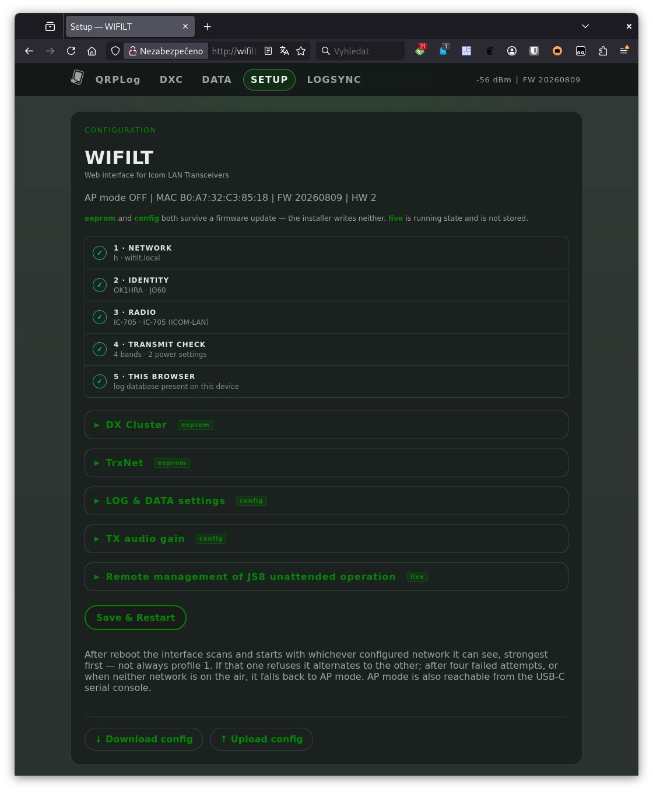

SETUP opens as five numbered steps. They are not a wizard: nothing remembers "which step you
are on". Each step works out its own state every time the page renders, by asking the device
what is actually stored. Reconfigure something months later, move to another network, or
reflash the board, and the steps rearrange themselves accordingly.

| Mark | Meaning |
|---|---|
| ✓ green | done |
| number, amber | your turn |
| number, grey | blocked — an earlier step has to happen first |
| — grey | not applicable to this configuration |

A ✓ is never taken back on its own. A radio that is switched off shows a grey **not
answering** dot beside step 3, but the step stays green: the setup did not break, the radio
is just off.

#### Step 1 — Network

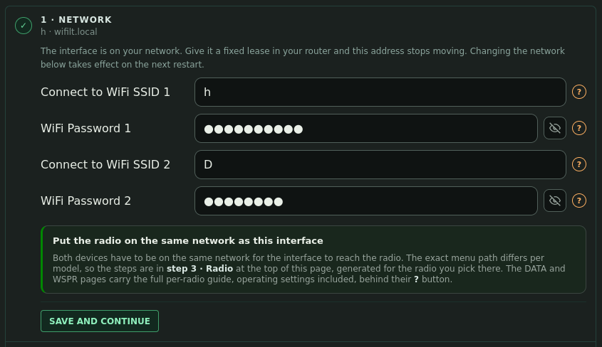

Two WiFi networks can be stored. At boot the device scans first and joins whichever
configured network is actually on the air, strongest signal first — not necessarily SSID 1.
If that one refuses it, it alternates to the other. If neither answers, it falls back to AP
mode.

In AP mode this step does not end in a save, it ends in a **handover**: press **SAVE AND
JOIN THE NETWORK** and the device joins your router *while its own hotspot is still
running*, then shows you the address it was given — as a link and as a **QR code**. Scan it
or write it down. The hotspot only closes when you then press **Restart and reconnect**.

> Fill in the callsign in step 2 before pressing this. Everything on the page is saved
> together, and the hotspot goes away at the end of the handover.

The handover screen also offers **Open the device now** and **Back to settings**. If the
device could not join, it says so — *"Neither network was found"* or *"Could not join …"* —
and lets you correct the credentials without losing the hotspot.

Once the device is on your network, this step shows the SSID and the address it is reachable
at. Give it a fixed DHCP lease in your router and that address stops moving.

#### Step 2 — Identity

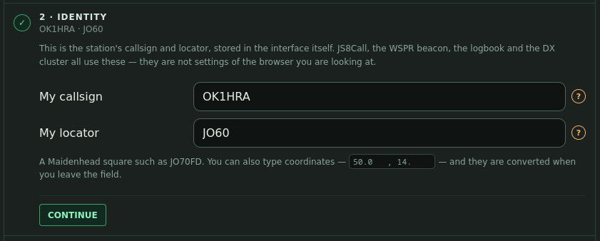

Your **callsign** and **locator**, and the only place either can be edited. The DX cluster
logs in with them, and they are what the logbook and the digital modes put on the air. The
JS8 and WSPR pages display them but cannot change them.

The locator must be a valid Maidenhead square or the step will not go green — and nothing is
saved, with the message *"The locator above was not accepted"*.

A compound callsign (`OK1ABC/P`, `9A/OK1ABC`) gets a warning: JS8 and the cluster take it as
it is, but **the WSPR beacon cannot encode it** — that needs a message type this version
does not build.

#### Step 3 — Radio

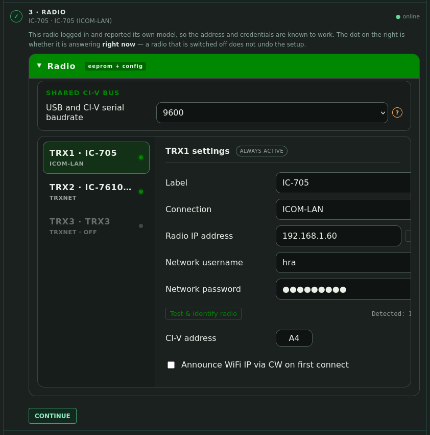

This is the only step with real work in it, and it is guided.

1. **Which radio?** Press your model — the buttons come from the built-in model table — or
   *other / not sure*. The instructions below change to that radio's actual menu path.
2. Do what the instructions say on the radio itself. For a WLAN model that is
   `MENU → SET → WLAN Set`: `WLAN` **ON**, `Connection Type` **Station**, and under
   `Access Point` the same network the interface is on. For an Ethernet model it is a cable
   to the same router with `DHCP` **ON**.
3. In the radio's network menu set `Network Control` **ON**, then **invent** a *Network User
   ID* and password — and type them into the form straight away.
4. **FIND RADIO** sweeps the network for the transceiver, so you never have to read the
   address off the radio's screen. It reports progress (`37/254`) and lists every radio that
   answered as a button — press one to fill the address in. A single hit fills itself in.
   If nothing answers, the page explains the likely reason rather than just failing.
5. **VERIFY** logs in once and reads the model back. That is what completes the step: it
   proves the address, the credentials, the radio's menu settings and the network path all
   work together. On success the settings are saved, the running client picks them up
   immediately, and the page moves on — **there is no restart**.

Under the guided walk sits the full **Radio** editor, folded away: three slots, transports,
CI-V addresses, labels. It is described in [section 8.3](#83-radio).

If the interface is still in AP mode, this step is blocked and says so — the radio lives on
your home network and cannot be reached from the hotspot.

#### Step 4 — Transmit check

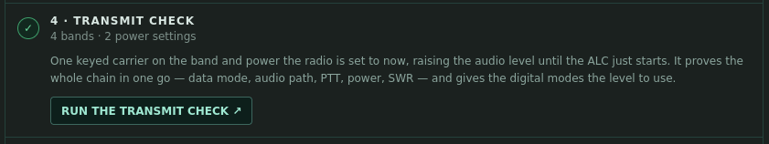

One keyed carrier on the band and power the radio is set to now, with the audio level raised
until the ALC just begins to act. It proves the whole transmit chain in one go — data mode,
audio path, PTT, power, SWR — and gives the digital modes the audio level to use.

This step is **advice, not a gate**. Without it JS8 and WSPR still transmit, just worse. It
opens the calibration on the WSPR page; see [section 8.6](#86-tx-audio-gain).

On a CI-V or TrxNet radio the step shows `—`: there is no network audio path, so there is
nothing to measure and nothing missing.

#### Step 5 — This browser

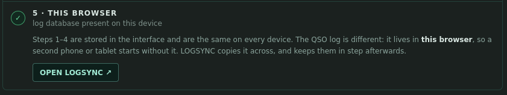

Steps 1–4 are stored in the interface and are identical on every device you open it from.
The QSO log is not: it lives in **this browser**, so a second phone or tablet starts empty.
This step tells you whether the browser you are looking at has a log database yet, and links
to LOGSYNC to copy one across.

A compressed version of the same five marks appears in the top bar of the DATA and WSPR
pages, so you can see at a glance whether anything is still outstanding.

### 2.3 Finding the interface later

The address is shown on the handover screen the moment the device joins, and
**<http://wifilt.local>** usually works from then on. A fixed DHCP lease in the router is the
permanent fix. Failing that:

- **From the router** — look for the DHCP lease named `wifilt` in the client list.
- **From a terminal** — `ping wifilt.local` prints the address it resolved to.
- **From the serial console** — connect USB, open a terminal at 9600 baud and press `?`.
  See [HARDWARE.md](HARDWARE.md#5-serial-console).
- **From the radio's headphones** — if *Announce WiFi IP via CW* is enabled, the interface
  reads its own address to you in Morse the first time it connects to the radio. It is
  sidetone only: break-in is forced off, so it never transmits. See
  [section 8.3](#83-radio).

Every method, and why the AP-mode "tap to open" prompt cannot exist on a home network, is in
[docs/find-device-ip.md](docs/find-device-ip.md).

### 2.4 What is stored where

This matters, because the three stores behave completely differently when something is
erased.

| Store | Contents | Survives a firmware update | Survives clearing browser data |
|---|---|---|---|
| **NVS** on the interface (`eeprom` badge) | WiFi networks, callsign, locator, radio login, cluster host, TrxNet, baud rate | ✅ | ✅ |
| **`cfg` partition** on the interface (`config` badge) | radio slots and the detected model, LOG settings, TX gain calibrations, CW and frequency memories, MSG BOX, the JS8 operating profile — heartbeat, groups, band schedule, power **and the APRS-IS gate login** | ✅ | ✅ |
| **The browser's database** | **your QSO log** | ✅ (it was never on the device) | ❌ **gone permanently** |
| Nothing (`live` badge) | the unattended-operation arming window — running state only | ❌ resets on restart | — |

The one that can be lost is the log, and it can only be lost by the browser. Back it up:
LOGSYNC → *Backup / Restore*, or the **BACKUP** button in QRPLog.

---

## 3. QRPLog

**`/log`**

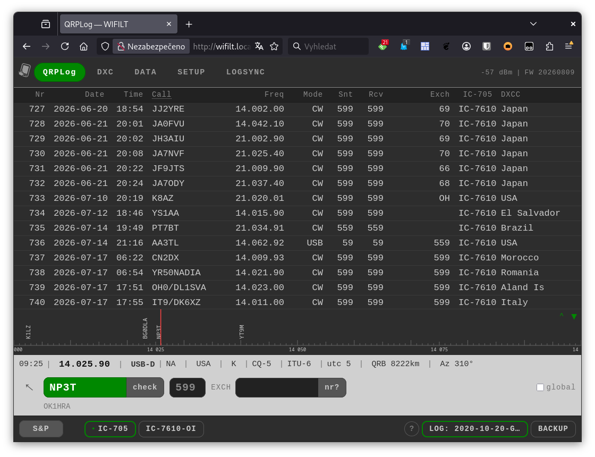

A contest and general logbook built for keyboard operation. It fills the window: a scrolling
journal on top, the radio status bar, the input row, and a button bar at the bottom.

The first time you open it, a disclaimer explains that the log lives in this browser's
IndexedDB — not on the ESP32 and not on a server — and asks you to tick that you have noted
the backup advice. Firefox users additionally get a standing warning bar (**Database at
risk**) with a **How to fix** button offering three remedies: bookmark the page, add a
storage exception, or back up regularly.

### 3.1 Logs: open, create, activate

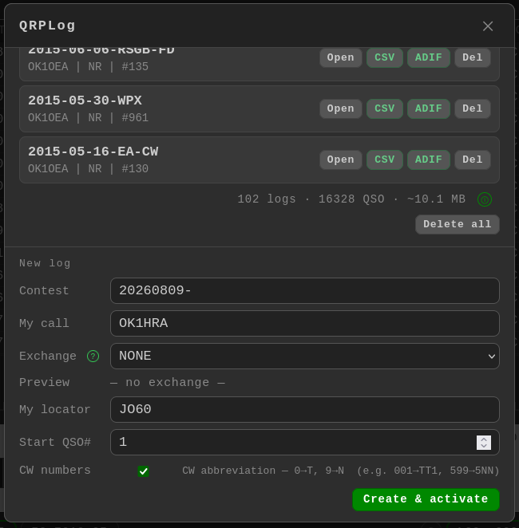

**LOG** opens the log manager.

*Saved logs* lists every log in this browser with its QSO count, filtered by the search box.
Each row has four actions:

| Action | Effect |
|---|---|
| **Open** | make this the active log — everything you log from now on goes here. The log that is already active shows an `active` tag here instead of a button. |
| **CSV** | download the log as CSV |
| **ADIF** | download the log as ADIF |
| **Del** | delete this log, after a confirmation |

**Delete all** wipes every log in the browser. It is deliberately a two-press action.

*New log* creates one:

| Field | Meaning |
|---|---|
| **Contest** | the log's name, e.g. `CQWW` |
| **My call** | the callsign sent in the macros for this log |
| **Exchange** | the exchange type — see below |
| **Exch value** | only for `STATIC`: the fixed exchange, e.g. `SK1`, `14`, `A` |
| **My locator** | used for the `NR+LOC` exchange and for QRB/azimuth |
| **Start QSO#** | first serial number |
| **CW numbers** | when ticked, CW abbreviations are used: `0→T`, `9→N`, so `001` is sent as `TT1` and `599` as `5NN` |

A live **Preview** shows exactly what the exchange will look like before you create the log.

### 3.2 Exchange types

| Type | Sends | Typical use |
|---|---|---|
| **NONE** | nothing beyond the report | ragchew logging |
| **NR** | serial number | most contests |
| **NR+UTC** | serial number and UTC time | contests that want the time |
| **NR+LOC** | serial number and locator | VHF and up |
| **STATIC** | a fixed string | zone, section, member number, power class |

The `?` beside the selector opens a help panel explaining each one.

### 3.3 RUN and S&P

The big button at bottom-left toggles the two operating styles, and it changes what the
Enter key does.

- **RUN** — you are calling CQ and others answer you.
- **S&P** — search and pounce; you tune around and call them.

`Alt+U` toggles it.

### 3.4 Working a station

Everything happens with Enter, and what Enter does depends on how much of the form is
filled.

**RUN mode**

1. Form empty, press **Enter** → the CQ macro goes out.
2. Type the callsign, press **Enter** → the exchange macro (`TXEXCH`) goes out and the
   cursor moves to the exchange field. A duplicate check runs at the same time.
3. Type the received exchange, press **Enter** → the QSO is logged, the `TU` macro goes out,
   RIT is reset on the radio, the serial number advances, and the form clears.

If you corrected the callsign between step 2 and step 3, the software notices: it sends a
`CALLTU` macro that re-announces the corrected call, and suppresses the ordinary `TU` so the
station is not thanked twice.

**S&P mode**

1. Type the callsign, press **Enter** → your own callsign is sent.
2. Type the received exchange, press **Enter** → the `TXEXCHSP` exchange macro goes out and
   the QSO is logged.
3. **prev exch** appears after logging: press it to re-send the *previous* QSO's exchange
   (`TXEXCHSP2`) if the other station asks for a repeat.

Between Call and EXCH sit **two report fields**, sent on the left and received on the right —
the same order as the `Snt` and `Rcv` columns in the journal below them, which is the only
legend they need. Both fill themselves in from the radio's mode — `59` on SSB, LSB, FM, WFM,
AM and DV, `599` on CW, RTTY and the data modes (`USB-D`, `LSB-D`), which carry a three-digit
report like RTTY — and each stops following the mode as soon as you type in it yourself. A
mode the radio reports as `UNK` changes nothing: an unreadable mode is no reason to overwrite
a field you are working in.

Both return to the default **when the QSO ends** — when it is logged, when you clear the form,
and when you empty the Call field, which is what abandoning a QSO looks like. That last one
matters: without it a `559` typed for a caller who faded away would be logged, silently, for
whoever came next. The reset deliberately does *not* fire when you start typing a new call, so
a report set before the callsign survives.

The cursor skips both fields — Enter runs Call → EXCH — but they are one `Tab` away, and
**Enter inside them is not a dead key**: it does what it would do in the field the flow is
waiting on. With no callsign entered that is Call, which in RUN transmits CQ; otherwise it is
EXCH, so it keys the exchange, or logs the QSO when both fields are filled. **Enter always
transmits** — `Tab` is the way out of these fields that keys nothing.

The sent report is also **what gets keyed**: change it to `579` and the macro goes out as
`57n`, not `5nn`. A value that is not a complete report is ignored rather than transmitted,
so a half-typed field cannot reach the air when Enter fires in RUN mode.

What the log records is **what was actually sent**, captured at the moment the macro was
acknowledged. Changing the field after the exchange has gone out does not rewrite it — fix a
genuine mistake by clicking the QSO in the journal instead. The received report has no such
history to protect: it is taken from its field **as it stands**, including a value that is not
a valid report. Logging `599` because the field read `4` would write down a report nobody sent
and nobody heard, and it would look correct in the journal forever. `N` is folded to `9`
(`5NN` is the CW spelling of 599), and an empty field takes the default.

Two buttons sit inside the input fields:

- **`*?`** (RUN) / **check** (S&P) — beside the Call field. `check` looks the call up in the
  log; `*?` requests a repeat of the callsign.
- **nr?** — beside the Exchange field, requests a repeat of the number.

`Alt+Enter` logs the QSO **without sending any macro** — useful when you have already worked
the exchange by voice.

`Alt+W` clears the form.

### 3.5 CW and RTTY macros

Macros are generated, not typed. What goes out depends on the radio's current mode, the
band, the exchange type and the CW-abbreviation setting. The **macro preview** line under
the input row always shows exactly what Enter would send right now.

For a CW contest with serial numbers, `OK1ABC` working `DL1XYZ` as QSO 7:

| Macro | Sent |
|---|---|
| `CQ` | `OK1ABC OK1ABC TEST` |
| `TXEXCH` (RUN) | `DL1XYZ 5nn TT7` |
| `TXEXCHSP` (S&P) | `5nn TT7` |
| `TU` | `tu OK1ABC` |
| `CALLTU` | `DL1XYZ tu` |

The locator is appended in two independent cases, and it is worth keeping them apart:

- with **`NR`** or **`NR+UTC`**, only **above 49 MHz** — `DL1XYZ 5nn TT7 JO70FD`;
- with **`NR+LOC`**, on **every band**.

So a plain serial-number contest on 2 m sends your locator whether you asked for it or
not, and an `NR+LOC` log sends it on 40 m too. In S&P the VHF form also ends with ` tu`.

The same contest in RTTY, where everything is doubled for readability:

| Macro | Sent |
|---|---|
| `CQ` | `OK1ABC OK1ABC OK1ABC TEST` |
| `TXEXCH` | `DL1XYZ DL1XYZ 599-007 599-007` |
| `TU` | `DL1XYZ tu OK1ABC` |

In **SSB and FM there are no macros** — nothing is sent, and Enter only logs. This is
unconditional and there is nothing to switch. With no macro sent, the log takes the sent
report straight from its field.

CW is handed to the radio as a CI-V message and the radio generates the Morse itself, in `CW`
and in `CW-R`. RTTY is keyed by the interface on its FSK and PTT outputs, in `RTTY` and
`RTTY-R`. **Those four modes are the only ones anything can be keyed in.** In a data mode
(`USB-D`, `LSB-D`), in `WFM`, or in a mode the radio does not name, the page says so and sends
nothing — the firmware has no keying path there and would drop the text. **`Esc` aborts a CW
or RTTY transmission immediately** — as long as no dialog is open.

### 3.6 The status bar

The strip between the journal and the input row, reading left to right:

| Field | Meaning |
|---|---|
| `--:--` | UTC time |
| Frequency | what the radio reports — or, when no radio answers, an editable **kHz** box and a mode selector (`USB LSB CW CW-R RTTY FM AM`) so you can log by hand. The mode you pick there also decides the report default, exactly as the radio's own mode would |
| Mode | the radio's current mode |
| Continent · Country · Prefix · CQ · ITU · utc | DXCC data resolved from the callsign you are typing |
| QRB · Az | distance and bearing from your locator |

When the exchange contains a locator, three more fields appear showing that locator, its
azimuth and its distance. A small azimuth indicator sits beside the Call field.

### 3.7 Duplicate and partial-call search

Pressing **Space** in the Call field searches the log. It does two jobs at once: a duplicate
check on the full call, and a partial-match search on a fragment — type `DL1` and space to
see every DL1 station you have worked.

Matches appear in a panel above the status bar. The **global** checkbox beside the input row
widens the search from the active log to *all* logs in the browser.

Clicking the **Call** column header opens a search box that filters the journal itself.

### 3.8 Blocked DXCC

Countries listed in SETUP → *Blocked DXCC list* are refused at the point of logging. Enter a
call from a blocked country and the form clears with `⛔ BLOCKED: <country>` for five
seconds — and in RUN mode the CQ macro goes out again immediately, so the run does not
stall. The same list hides those stations across the JS8 page.

### 3.9 The journal and editing a QSO

The journal shows `Nr · Date · Time · Call · Freq · Mode · Snt · Rcv · Exch · TRX · DXCC`.
It scrolls automatically as QSOs are added; `No QSO logged yet.` is shown while it is empty.

**Click any row to edit it.** The editor lets you change the fields and offers **Save**,
**Cancel** and **Delete**.

If the database write fails, the form is *not* cleared and the serial number does *not*
advance — the QSO is never silently lost.

### 3.10 Band map

When the DX cluster is connected, a band map appears above the status bar showing the spots
around your current frequency as a small spectrum. Two controls sit on it:

- **50 kHz / 100 kHz / 200 kHz** — the span, behind the `^` button.
- **▼** — fold the band map away.

### 3.11 Radio selection

**TRX1 / TRX2 / TRX3** choose which configured radio the log talks to — frequency, mode,
macros and RIT reset all follow the selection. `Alt+1`, `Alt+2`, `Alt+3` do the same. The
labels are whatever you named the slots in SETUP.

### 3.12 Export and backup

**BACKUP** downloads the whole QSO database as a JSON file. Per-log **CSV** and **ADIF**
exports are in the log manager. Everything else — restore, import, device-to-device sync —
is on the [LOGSYNC](#9-logsync) page.

### 3.13 Keyboard shortcuts

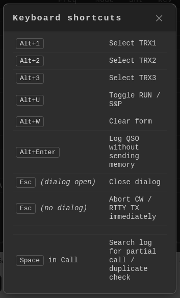

The **?** button opens this list.

| Key | Action |
|---|---|
| `Alt+1` / `Alt+2` / `Alt+3` | select TRX1 / TRX2 / TRX3 |
| `Alt+U` | toggle RUN / S&P |
| `Alt+W` | clear the form |
| `Alt+Enter` | log the QSO without sending a macro |
| `Esc` (dialog open) | close the dialog |
| `Esc` (no dialog) | **abort CW / RTTY transmission immediately** |
| `Space` in Call | duplicate check and partial-call search |
| `Enter` in Snt / Rcv | as if pressed in Call, or in EXCH once a callsign is entered — **it transmits**; `Tab` leaves without keying |

---

## 4. DXC — DX cluster

**`/dxc.html`** — opens in its own 600×750 window, so it can sit beside the log.

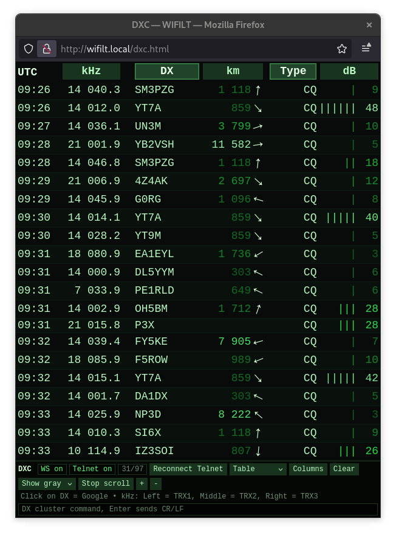

### 4.1 Connecting

The cluster host and port are set in SETUP → *DX Cluster*; the client logs in with your
callsign from *Identity*. Three status chips sit in the toolbar:

| Chip | Meaning |
|---|---|
| **WS** | the WebSocket between this page and the interface |
| **Telnet** | the interface's connection to the cluster server |
| **count** | `visible/total` spots — how many rows the filters are letting through |

**Reconnect Telnet** forces a fresh login to the cluster.

### 4.2 The spot table

| Column | Contents |
|---|---|
| **UTC** | spot time |
| **kHz** | frequency — a link, see below |
| **DX** | the spotted callsign — a link to a Google search |
| **km** | distance from your locator, with an arrow rotated to the bearing |
| **Spotter** | who posted it |
| **Type** | `CQ`, `DE`, or blank |
| **dB** | signal report, drawn as a small bar |
| **WPM** | keying speed |
| **Info** | the spot comment |
| **Raw** | the unparsed cluster line |

Distance and dB are colour-toned relative to the spread of what is currently visible, so the
best DX and the strongest signals stand out without reading numbers.

### 4.3 Filters

Five column headers are buttons that open a filter menu. A filter that is doing something
marks its button, and every setting is remembered in the browser.

| Filter | Controls |
|---|---|
| **kHz** | per-band checkboxes plus **All on** / **All off** |
| **DX** | free text, or a JavaScript regular expression when **Regex** is ticked (case-insensitive); **Clear** resets it. **Careful:** ticking Regex on an *empty* field pre-loads a ready-made expression rather than matching everything, and the filter persists in this browser until you clear it. The header button marks itself as filtering, but you have to open the menu to see what the expression actually is — so check it before deciding a band is dead. |
| **km** | a minimum and maximum distance, `0 – 20 000 km`, with a reset |
| **Type** | `CQ`, `DE`, `EMPTY` checkboxes |
| **dB** | a minimum and maximum, `−30 – 100 dB`, with a reset |

Separately, the **Dupe** selector cross-references the spots against your *active* log by
call and band:

| Setting | Effect |
|---|---|
| `Dupe: off` | ignore the log |
| `Show gray` | grey out stations already worked on that band |
| `Hidden` | remove them from the list entirely |

### 4.4 Working a spot

- **Click the DX callsign** → a Google search for that station opens in a new tab.
- **Click the kHz** → **TRX1** is tuned to the spot.
- **Middle-click the kHz** → **TRX2** is tuned.
- **Right-click the kHz** → **TRX3** is tuned.

TRX2 and TRX3 only respond if those slots are configured.

Visible spots are also published to the QRPLog band map.

### 4.5 Views, columns and the toolbar

| Control | Purpose |
|---|---|
| **view selector** | `Table` — the parsed spot table · `Raw` — the unmodified cluster stream · `Histogram` — spot activity per band |
| **Columns** | show and hide individual columns |
| **Clear** | empty the table, the raw log and the histogram |
| **Stop scroll** | freeze automatic scrolling so a row stays put while you read it |
| **+** / **−** | text zoom |
| **command box** | type any cluster command; **Enter** sends it with CR/LF |

The command box is a full telnet prompt — `sh/dx`, `set/filter`, `dx 14025 DL1XYZ` and
anything else your cluster understands.

---

## 5. DATA — JS8Call over ICOM-LAN

**`/data`** — the **JS8Call-ICOM** tab of the DATA page.

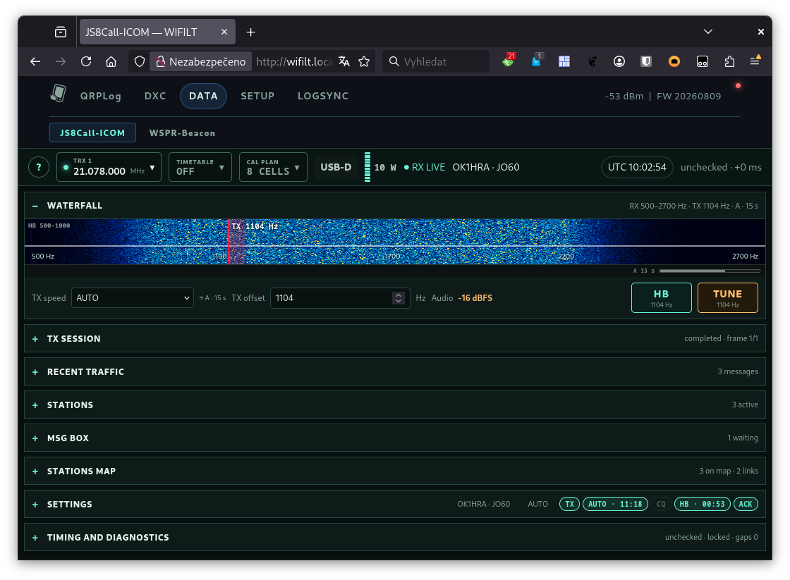

### 5.1 What the page is

A complete JS8 station in a browser tab. The radio's LAN audio stream is the sound card,
the decoder and encoder are WebAssembly running in the tab, and the ESP32 in between does
the keying and the CAT.

**It needs a radio on ICOM-LAN.** If no slot is configured for it, the page shows a refusal
card instead of opening — CI-V and TrxNet carry no audio, so there is nothing to decode.

**One live page per station.** Open the page a second time — another tab, another device —
and the newcomer says the session is already running elsewhere, showing where, and offers
**TAKE THE SESSION OVER HERE**. Two pages transmitting from one radio is the failure this
prevents.

Before the interface appears, a loader shows *Loading JS8Call-ICOM modem* with a percentage
while the modem components are fetched and started, and a **RETRY** button if that fails.

You can leave for QRPLog or SETUP and come back: apart from the interrupted audio stream the
session continues and no messages are lost.

Every block on the page is collapsible, and the collapsed header always carries the state,
so a folded section never hides something you need to know.

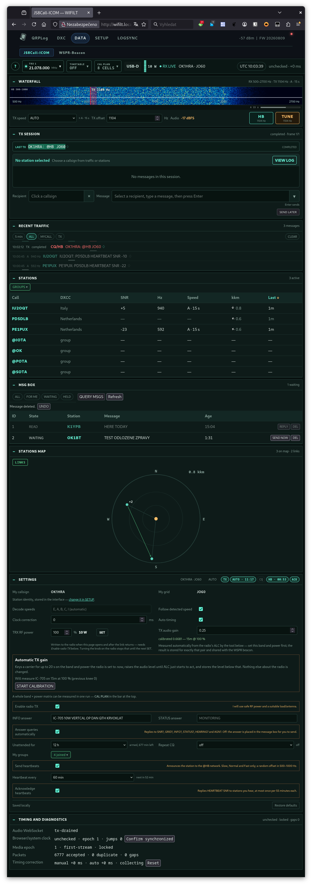

#### On the radio, once

JS8 needs three things set on the transceiver, and getting one of them wrong produces a
station that keys but radiates nothing. **The menu paths below are the IC-705's** — on the
IC-7610, IC-9700, IC-7300MK2 and IC-7760 the same setting is called `LAN MOD Level`. Press
**`?`** to get the paths for your own model.

1. `MENU → SET → Connectors → MOD Input → DATA MOD` set to **`WLAN`** — this is the one that
   silently costs you PTT-with-no-RF.
2. `MENU → SET → Connectors → MOD Input → WLAN MOD Level` — start at **25 %**.
3. Mode **USB-D**. Picking a band from the frequency menu sets USB-D for you if it is not
   already selected.

The **`?`** button at the left of the radio bar opens the same instructions for your model —
see [section 6.9](#69-radio-setup-help). It also opens **by itself the first time** this
browser loads the page, and again whenever the radio's mode is neither `USB-D` nor plain
`USB`.

A dial frequency that is not *exactly* one of the presets is treated differently: the
frequency button is coloured and its tooltip says so, but no dialog appears.

### 5.2 Header: radio, frequency, power, session

The bar across the top of the page, left to right:

| Control | What it does |
|---|---|
| **`?`** | radio setup help for your model |
| **TRX *n* · frequency** | which slot is on ICOM-LAN, and the dial frequency with a dot every three digits. A coloured dot shows whether the radio is answering. Click to open the dial-frequency menu. |
| **TIMETABLE** | the 24-hour frequency schedule — [section 5.16](#516-frequency-timetable) |
| **CAL PLAN** | the band × power TX-gain calibration matrix — [section 6.8](#68-tx-audio-gain-and-cal-plan). It turns **red by itself** when nothing is calibrated, or when the radio is on a band that has never been measured. |
| **mode** | the radio's mode, `---` when unknown |
| **power** | RF power as a ten-segment bar and in watts |
| **link state** | `● LOADING` and `● LOAD ERROR` while the modem starts, then `● RX WAIT` (connected, nothing arriving), `● RX LIVE` (audio flowing), `● TX` (transmitting), or `● OFFLINE` in red when the browser loses the interface — with a **Reconnect** button |
| **station** | your callsign and grid, as the interface holds them |
| **`✉ NEW MSG`** | unread mail — see below |
| **UTC clock** | and the clock-check state beside it |

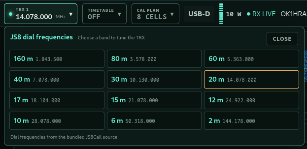

The frequency menu lists the standard JS8 dial frequencies per band. Choosing one retunes
the radio and sets USB-D.

#### Unread mail turns the whole bar red

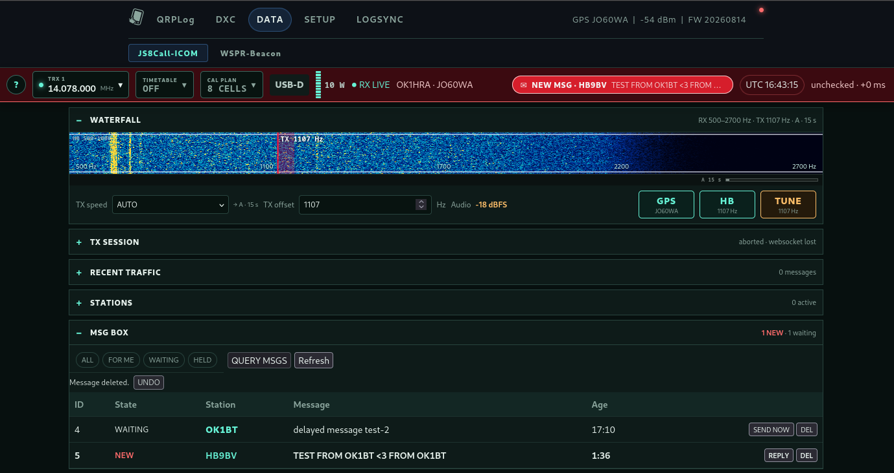

As soon as a message addressed to you is filed, the status bar changes colour and a red
button appears in it: **`✉ NEW MSG · <callsign>`** followed by the beginning of the text.
With more than one waiting it counts them — `✉ 3 NEW MSG · OK1BT`. The callsign is the one
that wrote the **newest** message; the whole text is in the button's tooltip.

The bar is the alarm because the count in the MSG BOX header is invisible while that section
is collapsed, which is how it normally sits — and an operator watching the radio rather than
the browser would never see it. The tab title carries the same count —
`(3) JS8Call-ICOM — WIFILT` — for when the page is in a background tab.

**Clicking the button opens MSG BOX and scrolls to it** ([section 5.11](#511-msg-box)). It
does nothing else: the message stays unread, because reading is confirmed by clicking the
message itself. The bar goes back to normal once every message for you has been read — or
deleted.

### 5.3 Waterfall

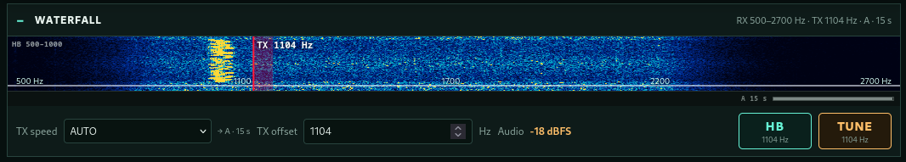

The decoder listens from **500 to 2700 Hz**; heartbeat traffic normally sits in 500–1000 Hz.
The scale is printed under the display.

- **Horizontal lines mark the JS8 time-slot boundaries**, so you can see whether a signal
  started on a slot or halfway through one.
- **Click** anywhere on it to set your transmit offset to that frequency.
- **Hover** and a thin vertical line previews where a click would put you. The callsigns of
  recently received stations appear rotated 90° above the waterfall at the frequency where
  they were last heard: newest in pure white, fading towards dark grey with age, with no
  time limit at all. They show while the mouse is over the waterfall and moving, and fade
  3 seconds after it stops or when it leaves.
- If audio is not arriving, an overlay says so in the top corner.

Under it sits the **slot meter** — the current submode and slot length (`A 15 s`) with a bar
filling as the slot runs — and the quick controls:

| Control | Meaning |
|---|---|
| **TX speed** | `AUTO`, or force a submode: `A` (15 s, normal), `B`, `C`, `E` (slow), `I` (fast). The resolved choice is spelled out beside it. |
| **TX offset** | your transmit frequency in Hz, 500–2700 |
| **Audio** | the received audio level in dBFS |
| **GPS** | beacon the radio's GPS position to APRS-IS — see [section 5.6](#56-aprsis-command-builder). Only present on a radio that answers GPS queries; the small line carries the current 6-character square. |
| **HB** | send one heartbeat now, at the offset shown |
| **TUNE** | key a steady tone at the offset shown |

**TUNE turns into STOP** while the carrier is up, and **GPS glows red** while position
tracking is armed.

*Enable radio TX* is the reason these buttons are greyed out most often, but not the only
one. Transmission is also refused while a calibration or a calibration plan is running, while
another transmission is in progress, when ICOM-LAN is offline, when the radio's own PTT is
down, when the mode is neither USB nor USB-D, while the encoder or decoder is still loading,
before the audio timebase has locked, when no callsign is set, and during a file transfer.
**Hover the button and its tooltip names whichever reasons currently apply.**

### 5.4 TX SESSION

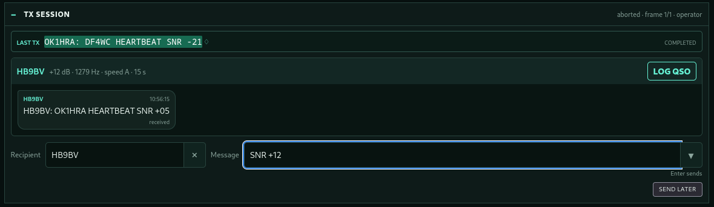

The conversation with one station.

The header names the selected station and the state of the exchange, and carries three
controls:

- **LOG QSO** — see [section 5.17](#517-logging-js8-qsos).
- a **transmit-queue indicator** while something is waiting to go out.
- **ABORT** — stop the transmission in progress.

Below it is the thread of messages with that station, then the composer:

| Field | Notes |
|---|---|
| **Recipient** | click a callsign anywhere on the page to fill it, or type one. **×** clears it. It refuses your own callsign — you cannot work yourself. |
| **Message** | the text. **Enter sends.** The **▾** opens the preset menu. |
| **SEND LATER** | do not transmit now: put the message in the MSG BOX and let it go out when the recipient — or someone who can hear them — appears on the band. See [section 5.11](#511-msg-box). It refuses messages over **120 characters**, group calls, and anything that is not a well-formed callsign. |
| **Routes** | under the field: stations that hear the recipient, so a message can go through one of them. See below. |

**Routes through an intermediary.** When you fill in Recipient, a line appears under the
Message field with the paths this station knows about. It stays collapsed while you are
hearing the addressee yourself, and opens on its own when you are not — or when the last
time you decoded them is more than 15 minutes old, which is exactly when a route is the
point. That is decided afresh for each addressee: collapsing it for one station does not
keep it shut for the next, whose situation is a different question.

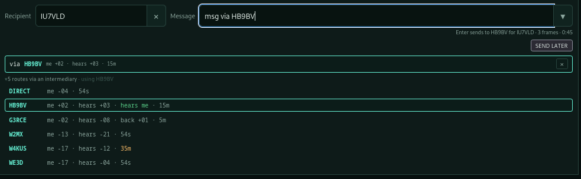

A message to **IU7VLD** about to go out through somebody else. The panel opened by itself
and offers **5 routes via an intermediary**, with **DIRECT** — IU7VLD's own signal, `me
-04`, heard 54 seconds ago — as the first row, so sending straight to them is still a
visible choice. **HB9BV** has been clicked: the row is framed, the badge above the list
repeats the evidence it rests on (`me +02 · hears +03 · 15m`) with **×** to drop it, and
the summary confirms it is *using HB9BV*. Nothing was written into the text — the words are
still the operator's — but the hint under the field now says where the frame is really
going: `Enter sends to HB9BV for IU7VLD · 3 frames · 0:45`. **W4KUS** shows what ageing
looks like: its `35m` is amber, the evidence still counts but the warning is there. Only
**G3RCE** has a `back` number, the addressee's own report of that station, and only HB9BV
has ever reacted to a transmission of mine — `hears me`, the one column that says the path
has been proved in both directions.

The list is built from the same evidence the stations map draws its green arrows with:
who has reported hearing whom in the last hour. Every row is a station **you decode
yourself** that has proved it copies the addressee. The first row is always **DIRECT**,
carrying the addressee's own signal, so sending straight to them stays a visible choice.

Each row shows the numbers the decision rests on:

| Column | Meaning |
|---|---|
| **me** | the signal *you* receive that station at |
| **hears** | what that station reported hearing *from the addressee* — or `ack`/`hearing` when the evidence was a reply rather than a report |
| **back** | what the *addressee* reported hearing from that station, when it is known |
| **hears me** | that station has reacted to one of your transmissions |
| age | how old the evidence is; amber once it is over half an hour |

An hour is the outer limit: a report older than that stops counting altogether and the
route simply leaves the list. The amber therefore means *ageing*, not expired — it is
your warning while the evidence is still there.

Rows are ordered by their **weakest hop** — a route is only as good as its worse end —
and evidence with no number sorts last. While the list is open the order is frozen, so a
row never moves between you deciding and clicking.

**Clicking a row arms the route**; it does not fill in any text. The message stays yours to
write. Recipient keeps showing the addressee — the thread, LOG QSO and the SNR preset all
still belong to them — and the chosen route appears as a badge under the field, with **×**
to drop it. The send hint says where the frame is really going, e.g. `Enter sends to OK2ABC
for OK1XYZ · 3 frames · 1:12`.

**Enter** then sends the message as mail to that station's inbox (`MSG TO:<addressee>
<text>`) and files it in the MSG BOX as `waiting`. The row only changes to **via OK2ABC**
when that station acknowledges storing it, which is the only proof of anything the
protocol can produce — nobody will ever tell you the addressee read it. That
acknowledgement also writes a line into the addressee's own thread. Until it arrives the
message is still ordinary waiting mail, so the automation may yet deliver it directly or
leave it with somebody else.

**SEND LATER with a route armed** pins it: the message waits for that one station and is
parked nowhere else. Direct delivery to the addressee is never blocked by a pin.

A route is a reading of the band at one moment, so it is deliberately short-lived. It is
dropped when you change the recipient, change band, press CLEAR, or send — and it does not
survive a reload. The pin written by SEND LATER is different: it lives in the MSG BOX
record and stays until the message goes out or expires.

If nothing can be offered the line says why — nobody you hear has copied that station, the
callsign is unknown on this band, or it is a group, where the question does not apply. A
station that a data-layer module has given its own encoding profile also has no routes,
and SEND LATER is disabled for it: stored mail is written as typed and kept on the
interface, and a third station does not share that profile anyway.

Sending is refused only for hard obstacles: a blocked DXCC entity at either end, an
exchange already open with that station, a callsign that cannot be packed into a directed
frame, or a group as the addressee. Stale evidence does **not** block — it turns the badge
amber and tells you its age. A draft that carries its own recipient (`@APRSIS`, `CQ`) takes
priority over the route and says so in the hint.

### 5.5 Message presets

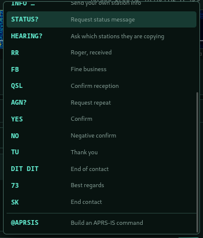

The **▾** beside the Message field inserts standard JS8 traffic without typing it:

| Preset | Meaning |
|---|---|
| **CQ CQ CQ** | general call |
| **SNR ±nn** | reply with the report you received |
| **SNR?** | request a signal report |
| **HW CPY?** | ask how you are being copied |
| **QSL?** | did you receive it? |
| **GRID?** | request the grid locator |
| **INFO?** / **INFO …** | request station info / send your own |
| **STATUS?** | request the status message |
| **HEARING?** | ask which stations they are copying |
| **RR** | roger, received |
| **FB** | fine business |
| **QSL** | confirm reception |
| **AGN?** | request a repeat |
| **YES** / **NO** | confirm / negative confirm |
| **TU** | thank you |
| **DIT DIT** | end of contact |
| **73** | best regards |
| **SK** | end contact |
| **@APRSIS** | opens the command builder — next section |

### 5.6 @APRSIS command builder

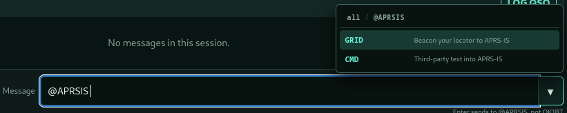

APRS-IS gateways listen on JS8 and forward what they hear into the APRS network. The
commands they take are exact and unforgiving, so the page builds them for you.

Choosing **@APRSIS** from the preset menu puts the group call in the **Message** field —
never in Recipient; that is what the gateways expect — and then re-fills the menu with the
things you can do next.

Two top-level commands:

| Command | Purpose |
|---|---|
| **GRID** | beacon your locator to APRS-IS |
| **CMD** | send third-party text into APRS-IS, addressed to a service or a callsign |

**GRID** takes one parameter, and the popup pre-fills it from your station locator:

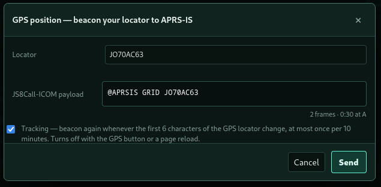

#### GPS position beacon

On a radio with a GPS receiver (the IC-705), the interface reads the position over CI-V
and a **GPS** button appears beside **HB** under the waterfall, its second line showing the
current 6-character square. The button unlocks only while the position is **current**: the
fix's UTC stamp is still moving — a test that works whatever the browser's own clock says —
and the radio's **GPS Select** is set to GPS. A position entered manually in the radio
shows in the navigation bar but never unlocks the button. On top of that it is a
transmission like any other, so **every condition that greys out HB greys out GPS too** —
*Enable radio TX* first among them. Hover it and the tooltip names whichever reason keeps
it locked.

Pressing it opens this same GRID window, pre-filled with the live **8-character** locator,
and its confirm button — **Send**, not Insert — transmits immediately, through the same
gates as SEND.

The window carries one extra choice here: **Tracking**. Ticked, the station beacons again
on its own whenever the **first six characters** of the locator change — crossing into a
neighbouring square — but never more than **once per 10 minutes**, counted from the last
GRID beacon of any origin, hand-sent ones included. Whatever cannot go out right now simply
waits: a square crossed during those 10 minutes beacons the moment they expire, a lost fix
pauses tracking until the fix returns, a busy transmitter defers to the next opportunity.
The button glows red while tracking is armed and pressing it again turns tracking off — as
does **a page reload**: tracking is deliberately never remembered, switching it on is
always a conscious action in this window.

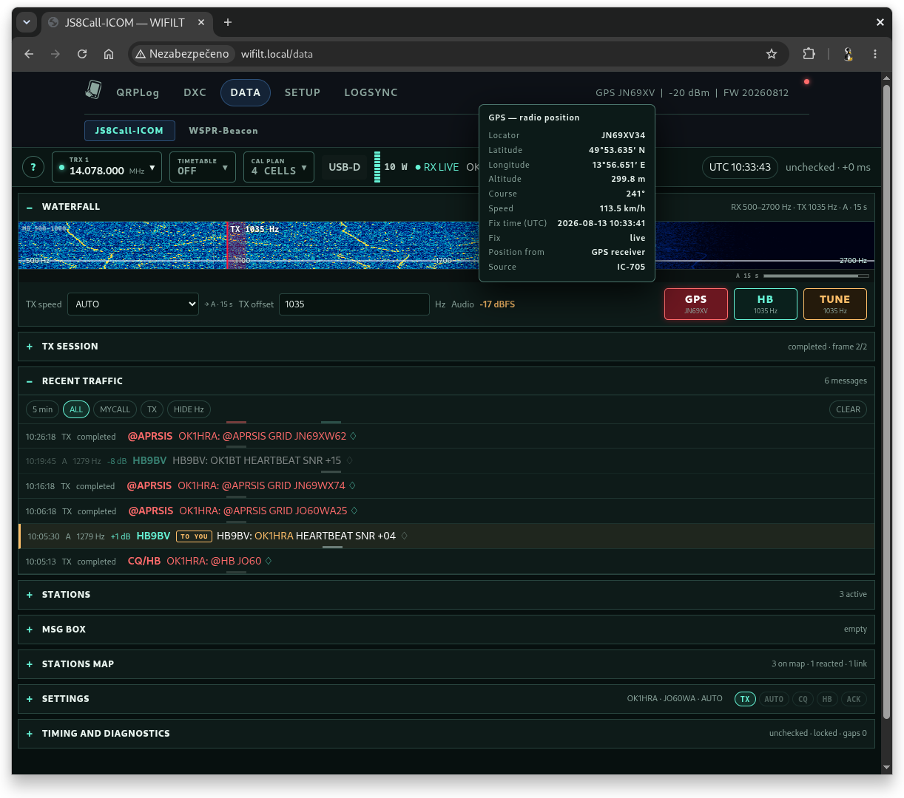

Tracking running in a moving vehicle, with the position panel from the navigation bar open
over it. **GPS** is red — armed — and Recent traffic holds the trail it left: `JO60WA25` at
10:06, `JN69XW74` at 10:16, `JN69XW62` at 10:26. Nothing was typed for any of them; each
went out because the six-character square had changed, and they stand exactly ten minutes
apart because that is the floor.

The picture also shows the waiting half of the rule. The radio has since moved on again —
the bar and the button both read `JN69XV`, the panel confirms a live fix at 10:33:41 — but
the last beacon went at 10:26:18, so that square cannot be announced before 10:36:18. It is
not lost; it goes out when the window opens, and if the square changes twice more before
then, only the one the station is actually in is transmitted.

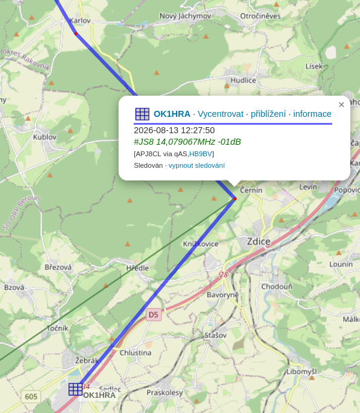

Where those beacons end up. This is the same run an hour later on **aprs.fi**, the trail
drawn from the squares the station announced on 20 m — no APRS transmitter, no VHF, no
internet at the vehicle end; every point on that line arrived as JS8 audio.

The popup is worth reading closely, because most of it was written by other people:

- **`#JS8 14,079067MHz -01dB`** — the comment is the *gateway's* work, not ours. The station
  sends nothing but `@APRSIS GRID <locator>`; the dial frequency and the signal report are
  what the gateway heard, added on the way through.
- **`[APJ8CL via qAS,HB9BV]`** — the path. `APJ8CL` marks the packet as coming from JS8, and
  **HB9BV** is the station that decoded it and put it into APRS-IS. It is the same HB9BV
  whose heartbeats sit in the traffic list of the previous picture: on the air it was simply
  another station being heard, and it was carrying the position onward at the same time.
- The timestamp is aprs.fi in local time — `12:27:50` there is `10:27:50` UTC, about a
  minute and a half after the 10:26 beacon of the previous picture was keyed. That gap is
  the transmission itself plus the gateway's decode.

The shape of the trail follows from the two locator lengths. Points appear roughly every
**six-character square** — a few kilometres, because that is what arms a beacon — while each
individual point is placed to the **eight characters** actually transmitted, some hundreds
of metres. So the line is a coarse but honest chain of real fixes, not an interpolated road.

Under **CMD** the menu offers the services APRS-IS actually runs, each with its own
parameter form and validation:

| Service | Parameters | What it does |
|---|---|---|
| **SMSGTE** | phone, message | SMS to a mobile phone |
| **EMAIL-2** | address, message | email through APRS-IS |
| **WLNK-1** | address, subject, message | a Winlink message |
| **APRS2SOTA** | callsign, summit ref, frequency, mode, comment | spot a SOTA activation |
| **APRS2POTA** | callsign, park ref, frequency, mode, comment | spot a POTA activation |
| **WHO-IS** | callsign | look a callsign up |
| **WXBOT** | place | weather forecast |
| **Direct callsign** | callsign, message | message an APRS user directly |

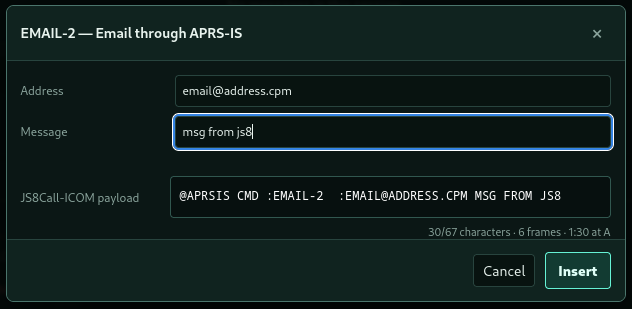

Every parameter form validates before it lets you continue — a locator must be a real
Maidenhead square, a SOTA reference must look like `OK/KR-001`, a POTA reference like
`OK-0022`, an address like `name@domain.tld`. Callsign, frequency and mode fields pre-fill
from your station and the current dial. The dialog shows the **exact JS8Call-ICOM payload**
that will go on the air and what it will cost in air time, then **Insert** puts it in the
message field.

**Worked example — email a short message via APRS-IS**

1. Select a station or leave the recipient empty; **@APRSIS** goes in the Message field.
2. From the menu choose **CMD**, then **EMAIL-2**.
3. Address `ok1abc@seznam.cz`, message `QRV 40M TONIGHT`.
4. The preview shows what will be transmitted; press **Insert**, then **Enter**.
5. The reply from APRS-IS comes back addressed to **@APRSIS**, and appears in Recent traffic.

When a received message contains `@APRSIS GRID`, the sender's callsign inside the message
text becomes an underlined link to their page on aprs.fi. The link is deliberately only
there — the green callsign at the left of the row stays a plain chat-selection control, and
there is no such link in the Stations table, where the context is not visible.

### 5.7 APRS-IS gate (IGate)

Section 5.6 is the outgoing direction: your station asking APRS-IS for something. This is
the other one. When any station on the band addresses **@APRSIS**, an IGate somewhere has
to pick that up and carry it to the internet, or it goes nowhere. Your interface can be
that IGate.

Nothing is transmitted on the radio. The traffic leaves over your network connection,
**under your callsign**, and only while the DATA page is open — that is where JS8 is
decoded.

Two kinds of message are carried, the same two a gateway understands:

| Heard on the air | What reaches APRS-IS |
|---|---|
| `OK2ABC: @APRSIS GRID JN79NX` | that station's position, plotted on aprs.fi |
| `OK2ABC: @APRSIS CMD :SMSGTE   :@+420… HI` | an APRS message to that service or callsign |

#### Switching it on

The gate is **off by default** and lives in JS8 **SETTINGS** — see
[section 5.14](#514-settings) for where the section is.

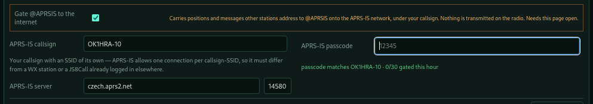

A gate ready to run. The switch is ticked, the callsign has been given an SSID of its own —
`OK1HRA-10` — and the line under the passcode is **green**: it names the callsign the number
was checked against and adds the hourly tally, `0/30 gated this hour`, which is still zero
because nothing has been carried yet. The server is left at the default `czech.aprs2.net`
on port `14580`. The note beside the switch is the whole arrangement in one sentence:
traffic addressed to @APRSIS goes onto the APRS-IS network under your callsign, nothing is
transmitted on the radio, and the page has to stay open.

| Field | What to put in it |
|---|---|
| **Gate @APRSIS to the internet** | the master switch |
| **APRS-IS callsign** | your callsign with an SSID of its own, proposed as `-10` — the convention for a full-time IGate |
| **APRS-IS passcode** | the number that belongs to your callsign — see below |
| **APRS-IS server** | `czech.aprs2.net` and port `14580` by default |

**Why the SSID matters.** APRS-IS allows one connection per callsign-SSID. If a weather
station or a copy of JS8Call on a PC is already logged in as plain `OK1HRA`, an interface
logging in under the same name will fight it for the connection and both will keep dropping.
Give this one its own SSID. Ticking the switch with the field empty fills in the `-10`
proposal for you; it is never written behind your back before that.

**Where the passcode comes from.** It is not a password you choose: it is a checksum
computed from your callsign, the same number every APRS program asks for. Ask whoever
provides your APRS-IS access, or use one of the usual generators. **The SSID plays no part
in it** — `OK1HRA` and `OK1HRA-10` have the same passcode — so a number that will not be
accepted is almost always one belonging to a *different callsign*.

**It is checked as you type it.** The line under the field turns green and names the
callsign it matches, or red and says which callsign it should have been computed from —
and while it is red the gate will not open at all. That is deliberate: APRS-IS accepts an
unverified connection and then throws every packet away without a word, so a gate with a
wrong passcode looks exactly like a working one for as long as nobody checks aprs.fi.

#### What it refuses to carry

Four filters sit between "somebody transmitted" and "your callsign published it":

- **An incomplete reception.** If the end of the message was lost, the text may be
  truncated — a `JN89HK` cut short to `JN89` is a valid locator tens of kilometres away.
  The row is still shown; it is simply not gated.
- **Blocked callsigns and DXCC entities.** The same list that hides a station from Recent
  traffic and refuses to answer it — see [section 3.8](#38-blocked-dxcc) — also refuses it
  a gateway.
- **A repeat.** The same station with the same content is carried once every ten minutes.
- **A ceiling of thirty packets an hour**, across all stations. Without it, one station on
  the band could push varying text through your callsign every fifteen seconds.

A message carrying a control character is refused outright, and that one is worth
explaining: APRS-IS is a line-based protocol and the JS8 alphabet contains a newline, so a
newline inside somebody's `CMD` text would not be a broken message — it would be a **second
packet of their choosing**, published under your callsign.

#### Reading the badges

A gated row in Recent traffic carries an **IGATE** badge, and it has five states rather
than two because "we sent it" and "the network took it" are different facts:

| Badge | Meaning |
|---|---|
| `IGATE …` | queued — waiting for a free moment, or for a retry |
| `IGATE ↑` | the interface has accepted it and is waiting for the server's answer |
| `IGATE ✓` | APRS-IS answered `verified`: the login was accepted |
| `IGATE ✗` | APRS-IS refused the login, or the packet could not be delivered |
| `IGATE –` | deliberately not gated — hover it for the reason |

Hovering any badge shows the **exact frame** that was published under your callsign. A
green badge is also a link: it opens the raw packet view for that station on aprs.fi, which
is the only place that can prove the position really arrived, path and all.

The **IGATE** marker in the SETTINGS header counts **verified** packets against the hourly
ceiling — `IGATE 7/30`. It counts what the network confirmed, not what was written, so a
gate that is delivering nothing can never read as a busy one.

> **Green is a strong sign, not a proof.** `verified` says the server accepted your
> *login*. A malformed or duplicate packet is dropped in silence even on a verified
> connection, which is why the badge links to aprs.fi rather than claiming the job is done.

#### One gate per station, not per browser

These settings live in the station profile, which is stored on the interface and read by
every browser that opens DATA. Setting the gate up once sets it up for the station — and
every one of those browsers then acts as a gate in its own right.

That is handled where it has to be: the duplicate check and the hourly ceiling are enforced
**by the interface**, not by the browser, because only the interface sees all of them. A
tablet and a phone both watching the same band will not publish one position twice, and the
ceiling is a ceiling for the station rather than for each screen. A row carried by another
browser still shows the badge, and its tooltip says the packet was already gated by this
station.

#### What it does when it cannot send right now

The interface will not open a socket while the transmitter is keyed, so during your own
transmission packets wait. Waiting is not failing: a packet is retried for **five minutes**
and only then dropped. It is dropped rather than delivered late on purpose — a position
report carries no timestamp, so one arriving ten minutes afterwards would be plotted as if
the station were there now.

#### Two differences from JS8Call

Both are deliberate and both were checked against the APRS specification.

- **The position is the centre of the locator's cell, not its south-west corner.** JS8Call
  never adds the half cell, so its spots sit about 1.2 km south and 1.6 km west of the
  station — tens of kilometres on a four-character locator. The consequence is worth
  knowing: a station gated by both yours and a JS8Call IGate will appear on the map twice.
- **The path says `qAR`, not `qAS`.** `qAR` means "an IGate received this on the radio",
  which is what happened; `qAS` claims a server put it there. Your callsign follows it, so
  a packet can be traced back to your interface.

### 5.8 Recent traffic

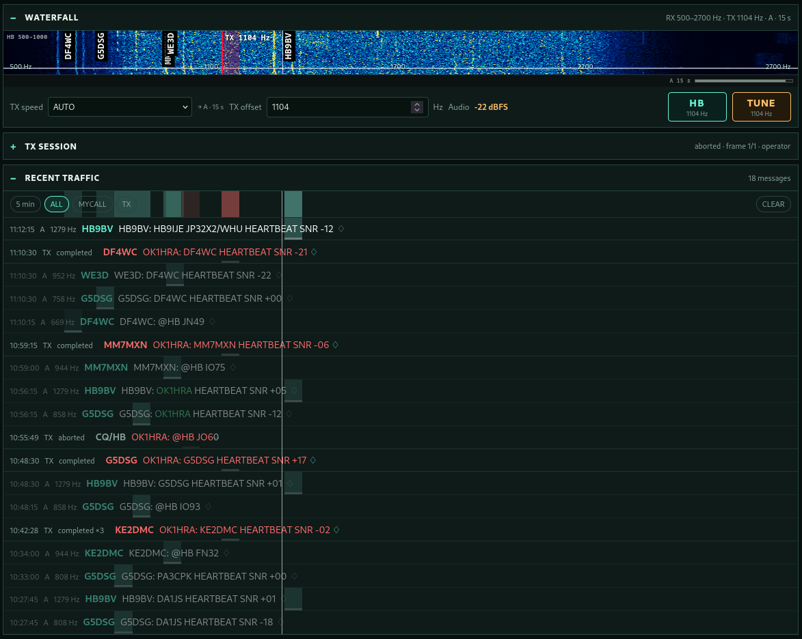

Everything decoded, newest last. Long lines wrap; nothing is truncated.

**The stripe under every line is the point of this section.** Each decoded message carries a
dark grey stripe positioned at that station's place on the waterfall's own frequency axis,
and drawn the width of a JS8 signal. You can look at a trace on the waterfall and find its
text, or read a line and see where on the band it came from, without matching numbers. The
stripe also encodes age and signal strength. Hovering the waterfall expands the low stripes
to full height and lightens each row in proportion to its signal.

The filter row doubles as a **band-occupancy histogram**: all the visible stripes stacked
together.

| Filter | Shows |
|---|---|
| **5 min** | only the last five minutes |
| **ALL** | everything |
| **MYCALL** | only traffic involving your callsign |
| **TX** | only your own transmissions |
| **HIDE …** | removes one meta column per press — see below |
| **CLEAR** | empties the traffic list **and** the TX rows |

Every received line also states the **signal report it was decoded at**, next to the speed
and the audio offset. It is the same measurement the stripe uses for its shading, said as a
number. A line with no report — a station you were only told about — leaves the field empty
rather than printing `+0`, which would be an invented measurement.

**HIDE narrows the row one column at a time.** The button always names what the *next* press
will remove, so you never have to press it to find out: `HIDE Hz` → `HIDE SPD` → `HIDE SNR`
→ `HIDE TIME` → `SHOW ALL`, then round again. The order runs from the column the line can
most afford to lose to the one it cannot — the offset goes first because the stripe already
shows where in the passband the signal sat, and the timestamp goes last because it is the
anchor the feed is read by. Useful on a phone, where the meta columns squeeze the message
text. The setting is remembered.

**A callsign you have already worked on this band is dimmer.** The test is the JS8CALL log's
real content (see [section 5.17](#517-logging-js8-qsos)), so it survives a reload and a QSO
logged from another window. It never disables anything — answering a station a second time
is perfectly legitimate — it only lets your eye skip to the stations still worth working.

**Your own transmissions appear here in their own colour**, and they distinguish what was
actually radiated from what was not — `TX prebuffering`, `TX completed`, `TX fault`. Without
that you cannot audit what an unattended station did while you were away.

A **`TX fault` row grows a `RESEND` button**. Note that the software *also* makes one
automatic second attempt of its own, so you may see a retry you did not click.

#### Answering a CQ from the line that carries it

A line that is a **CQ** grows a **`REPLY`** button at its end.

**One press sends. There is no confirmation step and no second click.** The press makes that
station the recipient in TX SESSION, opens the session, and hands a signal report —
`SNR -12`, the report *that line* was decoded at — straight to the transmit queue. It is the
standard answer to a CQ, and it also completes half of the signal-report exchange that logs
the QSO automatically once the other station answers.

The corollary matters just as much: **nothing at all happens until you press it.** The button
is the whole decision.

A CQ is recognised from the decoder's own frame type, not by looking for the letters "CQ" in
the text — a station saying "TNX FOR CQ" is not calling one.

**The button is always drawn, and says why when it will not fire.** Hover it for the reason:

| Refusal | Why |
|---|---|
| the CQ is more than five minutes old | they are almost certainly in a QSO by now, and the answer would go nowhere |
| you already answered that station since that call | a second report is a second transmission for nothing |
| a transmit gate is shut | the same conditions that grey out SEND — LAN down, wrong mode, TX not enabled |
| no report was measured | nothing to send; this happens on a station you were only told about |

Being already in the log does **not** refuse it. That only dims the callsign.

The report goes out at the next JS8 slot, like every other transmission — so there are up to
15 seconds between the press and the carrier. That is not a confirmation step: it needs
nothing from you and the report goes out by itself. It does mean **`ABORT` in TX SESSION can
still stop it** if you pressed the wrong line.

> **The station never answers a CQ by itself.** `REPLY` is the only path from this list to
> the transmitter, and it is a click. Unattended operation
> ([section 5.13](#513-unattended-operation)) answers *questions* addressed to you — `SNR?`,
> `GRID?` and the rest — and nothing else.

#### When somebody calls you

A line **addressed to your callsign** gets a green border and a `TO YOU` badge. This is the
one line in the list you have to act on, so it is the strongest state in it. Being merely
*mentioned* — your callsign in somebody else's `HEARING` list — does not count and is not
marked; that happens constantly on a busy band.

Nothing is transmitted in response. What happens next is yours: the station is one click
away in the line, and TX SESSION is already open.

**Beep on a call to me** in [SETTINGS](#514-settings) adds a short tone to that moment. It
is **off by default** — the page is meant to be left running for days beside a radio that is
already making noise. Ticking the box sounds the tone once so you know it works. Browsers
refuse to play sound until the page has been clicked at least once, so on a tab that has
only ever been looked at, the highlighted line is all you get.

**A line carried to APRS-IS gets an `IGATE` badge**, if you run the gate. It says what
became of that packet on the network, and hovering it shows the exact frame that went out
under your callsign — [section 5.7](#57-aprs-is-gate-igate).

**Partial messages are shown while they are still arriving.** A multi-slot message assembles
in place, including the damaged and missing pieces, with a blocking `|` marker at the end
while more is expected. Seeing a partial message is not the same as the station acting on
it — the automatic functions wait for a complete, checked message.

> **Your own callsign will appear as a received station, in red, immediately after you
> transmit.** This is not a fault. The radio's LAN audio is duplex — receive audio keeps
> flowing during transmission — so the decoder hears your own monitor. It is also why
> receive audio is deliberately never muted while keying.

### 5.9 Stations

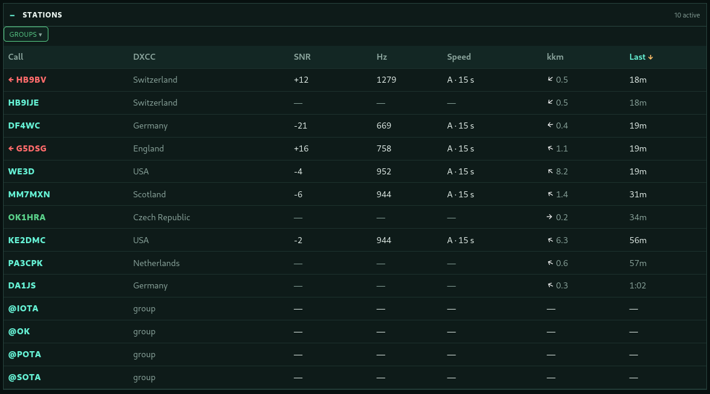

Every station heard, in a sortable table. Click a column header to sort by it.

| Column | Contents |
|---|---|
| **Call** | the callsign — click it to select it in TX SESSION |
| **DXCC** | entity resolved from the prefix |
| **SNR** | last signal report |
| **Hz** | audio offset where it was heard |
| **Speed** | the submode it was using |
| **kkm** | direction and distance in thousands of kilometres |
| **Last** | when it was last heard |

A **⏸** beside a callsign means automatic replies to that station are paused, with the
remaining time in the tooltip — see [section 5.13](#513-unattended-operation).

The list stops growing at the height of the screen and then scrolls.

**GROUPS** opens the group palette — the same one as in SETTINGS; see
[section 5.12](#512-groups).

Stations from blocked DXCC entities never appear here at all. They are discarded silently,
across the table, the traffic list, the TX session **and every automatic function**.

### 5.10 Stations map

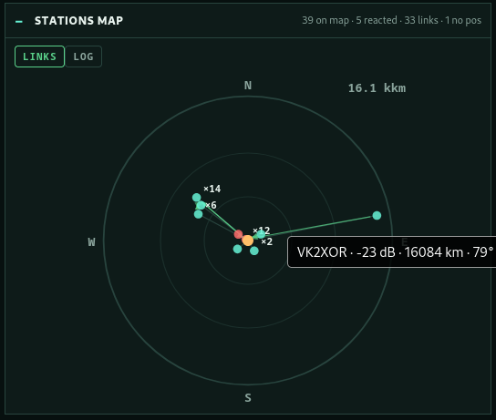

The same stations plotted by locator.

- A **red dot** means that station reacted to one of your transmissions — answered your
  heartbeat, or took part in an automatic exchange. It is the proof you were heard there.
- A **hollow ring** is a station that has been mentioned by others but never decoded here.
- **LINKS** toggles green arrows between third-party stations showing **who hears whom**,
  over the last 60 minutes. It is on by default.
- **LOG** switches the distance scale from linear to logarithmic. On a linear plot one DX
  station sets the scale for everything: with a contact 15 000 km away on the map, a
  neighbour 150 km out lands about one pixel from the centre, under your own dot, usually
  merged with every other nearby station into a single clustered dot. On the log scale that
  same neighbour sits about half way out, and the DX station stays on the rim where it was.
  In this mode the two plain rings are replaced by labelled **decade rings** — 10, 100,
  1 000 and 10 000 km, whichever of them fit — because a ring at half the radius no longer
  means half the distance and a plot without a scale is just a picture. The corner reading
  is prefixed `LOG`. Off by default; the choice is remembered.

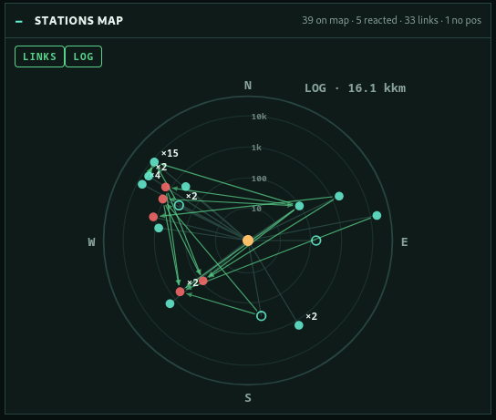

The same 39 stations, the same moment, with **LOG** on. On the linear plot above they are
three clumps around the centre — `×14`, `×12`, `×6` — and the links between them have nowhere
to be drawn; here the decade rings pull them apart into individual dots and the 33 hearing
links become readable. The clump counts that survive are the stations genuinely sharing one
locator square.

### 5.11 MSG BOX

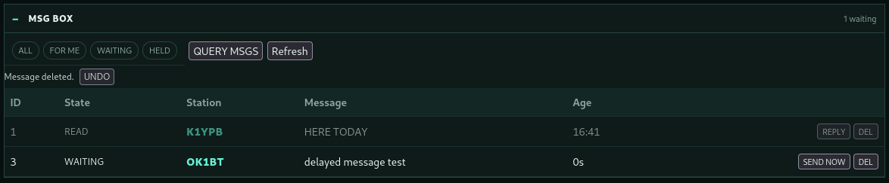

Store-and-forward mail, in both directions: messages left here for you, and messages you
left for stations that were not on the air.

Unread mail for you is signalled twice: `1 NEW` in this section's own header, and — because
that one is invisible while the section is collapsed — the **red status bar** at the top of
the page with the sender on it, described in
[section 5.2](#unread-mail-turns-the-whole-bar-red). Clicking the button up there brings you
here. Neither of them expands the section by itself; opening it is your decision, and
clicking a message is what marks it read.

| Filter | Shows |
|---|---|
| **ALL** | everything |
| **FOR ME** | messages addressed to me |
| **WAITING** | my messages waiting for their recipient to appear |
| **HELD** | mail this station is holding on behalf of other callsigns |

The state column of a message of your own reads **waiting** while it is still trying,
**waiting for OK2ABC** when you pinned it to one intermediary, and **via OK2ABC** once
that station has acknowledged holding it.

| Button | Action |
|---|---|
| **QUERY MSGS** | ask the selected station whether it holds anything for you |
| **Refresh** | re-read the box |

**Answering somebody else's `QUERY MSGS`.** Asked by name, this station answers either
`YES MSG ID n` or `NO`. Asked through a group — `@ALLCALL QUERY MSGS`, which is how a station
canvasses the whole band — it answers **only if it actually holds mail** for the asker. A
`NO` there would be sent by every station hearing the call, all in the same slot, burying the
one answer worth having. When several members do hold mail, each answers on a free offset of
its own rather than on its usual one. `MSG`, `MSG TO:` and `QUERY MSG` sent to `@ALLCALL` are
ignored outright: storing mail for everybody, or handing a message over because anyone asked,
is not something a call to the whole band may trigger.

A station signing **portable collects its own mail**: a message left for `OK1BT` is handed
over when `OK1BT/P` asks for it, the same way JS8Call matches the base callsign.

The table lists `ID · State · Station · Message · Age`. The buttons on a row depend on what
that row is: **FETCH** and **DEL** on a message somebody has advertised, **ASK** and **DEL**
on a message that arrived unreadable, **REPLY** only on one addressed to you, and **SEND
NOW** only on your own deferred message — it sends it immediately instead of waiting for the
recipient to appear. A deletion can be taken back with **UNDO** for a moment afterwards.

**Mail that arrived through somebody else.** A station that cannot reach you directly can
hand its message to a third station, which passes it on. Such a message is filed under the
callsign that **wrote** it, with the station that carried it shown underneath as
`via OK1XYZ`, and it is acknowledged back along the same path — the sender may not be within
reach of your signal at all. That is also why **REPLY** on such a row warns you: an answer
addressed straight to the sender may never arrive, and going through the intermediary again
is often the only way back. Machine traffic that came the same way — a relayed `ACK`, a
signal report — shows in the conversation but is never filed as mail.

**When a message for you arrives damaged.** A fading path can leave a message half-decoded
or with a failed checksum. It still appears in Recent traffic, marked `incomplete` or
`bad crc` — and, because you can see that something was addressed to you, the station now
asks for it again instead of dropping it in silence. The pending request gets its own row in
the box: *Unreadable MSG from OK1BT (bad crc) · 3 asks*.

It asks in the order that survives a collision. The first question is **`QUERY MSGS`** —
*do you hold anything for me?* — because it is answered out of the other station's message
store, which means the answer is the same an hour later. If it answers `YES MSG ID 7`, the
message is then fetched **by that id** with `QUERY MSG 7` and acknowledged, the same
addressed exchange used for any other stored mail. Only if the station answers `NO`, or does
not answer twice, does it fall back to **`AGN?`** — *say that again*.

That order matters more than the interval, because `AGN?` is answered with the other
station's **last transmission, whatever it was**. If your question happens to land on top of
their slot, a lost `QUERY MSGS` costs one turn and can simply be asked again; a lost `AGN?`
usually costs the message, because by the next attempt their last transmission is a heartbeat
or somebody else's reply.

| State on the row | Meaning |
|---|---|
| **asking** | asking `QUERY MSGS` on its own: after 1, 2, 5, 10, 20 and then every 30 minutes, paused while the station is not being heard and resumed when it is, for up to a day |
| **collecting** | the station said `YES` — the message is being fetched by id |
| **asking AGN?** | the station holds nothing, so the fallback is running |
| **operator** | automatic asking has stopped, and the row says why |

There is no limit on the number of attempts: knowing a message exists is a standing reason to
keep asking. What ends the automatic part is the answer becoming unavailable — and only in
the `AGN?` phase, because once the station has transmitted anything else, that question can
no longer return your message. `QUERY MSGS` is never invalidated this way. **ASK** overrules
all of it and asks once immediately, including when the row has gone to **operator**: you may
know something the station does not, such as that the other end is still repeating the same
message. **DEL** gives up on it.

The station will not ask **into** somebody else's transmission: a question is held back while
a message is still arriving, and while the one-minute quiet period after any directed traffic
is running — the same rule that keeps automatic replies from talking over a conversation. A
held-back question shows the reason on the row and goes out at the next opportunity.

Asking is automatic only while the station is armed (see [section
5.13](#513-unattended-operation)); with `Answer queries automatically` off, the row is there
and **ASK** works, but nothing goes out by itself.

**How SEND LATER actually delivers.** A deferred message waits until either the recipient
shows up on the band themselves — a heartbeat, a CQ — in which case it goes **direct**; or
somebody who *hears* the recipient shows up, in which case it goes **through that
intermediary**. This happens whether or not you are at the keyboard.

**Pinned messages.** If you armed a route before pressing SEND LATER
([section 5.4](#54-tx-session)), the message is pinned to that one intermediary: no other
station may hold it, however convenient. Direct delivery to the recipient is unaffected —
a pin narrows who may *carry* the message, not who may receive it. The row shows the
station it is waiting for.

When the box runs out of room, messages that are *not* addressed to you are evicted first,
then the oldest ones.

### 5.12 Groups

Group calls (`@ALLCALL`, `@HB`, `@OK`, …) let several stations share one addressee. The
palette is reachable from two places — **GROUPS** in the Stations table and **My groups** in
SETTINGS — because both are places where joining one is the obvious next thing to do.

Click a name to join or leave it. `@ALLCALL` and `@HB` are always joined and cannot be left.
The form at the bottom adds a group of your own — type the name in the `@OWNNAME` field and
press **ADD**.

> A non-standard group name costs a second frame — roughly 15 seconds more air time per
> message. The standard ones are free.

### 5.13 Unattended operation

This is what the page is really for: leaving the station on, walking away, and finding out
afterwards exactly what it did.

**`Answer queries automatically` is the arming switch.** This is the one thing to understand
about the section: that tickbox does not merely enable query answers, it arms unattended
operation as a whole. With it off, the station sends no heartbeats, acknowledges none,
answers nothing and relays nothing, whatever the other boxes say.

| Setting | Effect |
|---|---|
| **Answer queries automatically** | **arms unattended operation**, and replies to `SNR?`, `GRID?`, `INFO?`, `STATUS?`, `HEARING?` and `AGN?`. It is also what lets the station send `AGN?` *itself* when a message addressed to you arrives unreadable — see [section 5.11](#511-msg-box). With it **off**, an answer is placed in the message box for you to send by hand instead. |
| | `AGN?` repeats what was last sent **to the asking station**, or — matching JS8Call — the station's last transmission of any kind when there was none, so a station that copied your CQ garbled can ask for it again. Asked through a group, `AGN?` is never answered: every member would repeat a different message into the same slot. |
| **Unattended for** | how long the arming lasts: 1, 6, 12, 24 or 168 hours. It only sets the length — it does not arm anything by itself. The state beside it counts down, and reads `disarmed` when off. |
| **Repeat CQ** | calls CQ on an interval. **The exception:** this one runs whether or not the station is armed. |
| **Send heartbeats** / **Heartbeat every** / **Acknowledge heartbeats** | announce the station on the `@HB` network, and answer other stations' heartbeats with `HEARTBEAT SNR` |

The heartbeat interval defaults to **60 minutes**, and the indicator shows the time to the
next one. The interval stretches by itself when the band is busy, and the countdown reflects
that.

Two things about the automatic heartbeat that the manual **HB** button does not share: it
goes out at a **random offset between 500 and 1000 Hz**, not your TX offset, and it is only
sent on submodes **E, A and B**. Force TX speed to `C` or `I` and heartbeats are silently
skipped.

#### Why an armed station can go quiet

Automatic replies are rate-limited, and the limits are strict enough that an operator who
does not know about them will think something has broken:

| Limit | Value |
|---|---|
| The same question from the same station | answered at most once every **5 minutes** |
| …from the station you are currently working | once every **1 minute** |
| Heartbeat acknowledgement, per station | once every **55 minutes** |
| A station that keeps asking | banned for 1 minute, then 2, 4, 8 … doubling up to a **64-minute** ceiling |
| Everything together | at most **120 replies per hour** |

A station currently serving a ban is marked **⏸** in the Stations table, and its row dims.
The tooltip gives the reason and the time left — *"Auto replies paused 8 min (level 3)"*.

> **Unattended operation is bound to a live browser.** There is deliberately no hard air-time
> cap — an automatic station has to be able to send long messages without being cut off
> mid-transmission. Instead the firmware requires a heartbeat from the page proving the
> browser is alive. **Close the browser and transmission stops.** Keep the tab open and the
> screen awake; the page holds a wake lock for exactly this reason.

**Worked example — a beacon that may answer for itself**

1. SETTINGS → tick **Enable radio TX**.
2. Set **INFO answer** to `50W VERT`, and pick a **STATUS answer** — `AUTO STATION
   UNATTENDED`, or **Follow the station**, which answers with the time left on the arming
   window. These are what `INFO?` and `STATUS?` will be answered with.
3. Tick **Answer queries automatically**.
4. Tick **Send heartbeats**, leave **Heartbeat every** at 60 minutes, tick **Acknowledge
   heartbeats**.
5. Set **Unattended for** to 6 hours — the choices are 1, 6, 12, 24 and 168 hours.
6. Leave the tab open with the screen awake. On your return, the **TX** filter in Recent
   traffic lists every transmission the station actually made, and the MSG BOX holds
   anything that arrived for you.

Unattended operation can also be revoked remotely from SETUP — see
[section 8.8](#88-remote-management-of-js8-unattended-operation).

### 5.14 SETTINGS

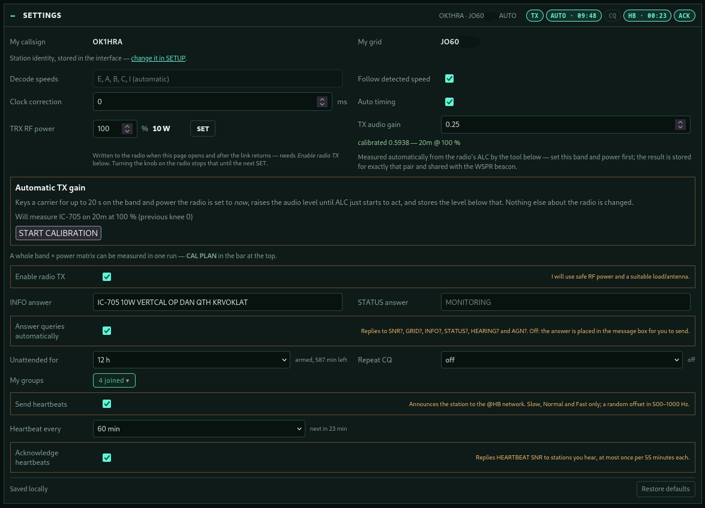

The collapsed header carries small non-clickable markers showing which functions are
currently active, so you can see the station's posture without opening the section. All but
one go grey when *Enable radio TX* is off, because none of them can reach the air without
it; **IGATE** is the exception, since it publishes to the internet and never keys the
transmitter. Its number is verified packets against the hourly ceiling —
[section 5.7](#57-aprs-is-gate-igate).

| Setting | Meaning |
|---|---|
| **My callsign** / **My grid** | shown, not editable. They belong to the interface, not to this browser — a second tablet with its own copy is how a station ends up answering under two callsigns. **Change them in SETUP.** |
| **Decode speeds** | fixed: `E, A, B, C, I (automatic)` — all of them, always |
| **Follow detected speed** | match your transmit submode to the station you are working |
| **Clock correction** | milliseconds of offset applied to slot timing. **Deliberately per-device** — a PC never overwrites a tablet's value. |
| **Auto timing** | let the software correct the clock from decoded traffic |
| **TRX RF power** | percent, with the watts shown beside it and a **SET** button. Written to the radio when the page opens and after the link returns. **Turning the knob on the radio stops that until the next SET.** Needs *Enable radio TX*. |
| **TX audio gain** | 0.1–0.8. The line under it says what is actually in force — the measured value for this band and power, or the manual one with the reason. Shared with the WSPR beacon: one modulator input, one level. |
| *(calibration panel)* | the automatic gain measurement, identical to the one on the WSPR page — [section 6.8](#68-tx-audio-gain-and-cal-plan) |
| **Enable radio TX** | **the master switch.** Off, and nothing transmits: HB, TUNE, auto-reply, heartbeats, CQ repeat and the calibration are all disabled, and their markers in the header go grey. The tickbox carries the pledge *"I will use safe RF power and a suitable load/antenna."* |
| **INFO answer** | up to 40 characters, e.g. `50W VERT` |
| **STATUS answer** | a menu — see [What the station answers to STATUS?](#what-the-station-answers-to-status) |
| **Answer queries automatically** · **Unattended for** · **Repeat CQ** · **My groups** · **Send heartbeats** · **Heartbeat every** · **Acknowledge heartbeats** | see [section 5.13](#513-unattended-operation) |
| **Beep on a call to me** | a short tone when a station addresses your callsign directly. **Off by default.** The line in Recent traffic is highlighted either way — see [section 5.8](#58-recent-traffic). Ticking it plays the tone once, which is also the click browsers require before they will allow any sound. Purely local to this browser; it never transmits anything. |
| **Gate @APRSIS to the internet** · **APRS-IS callsign** · **APRS-IS passcode** · **APRS-IS server** | carry other stations' `@APRSIS` traffic onto the APRS network under your callsign. Nothing is transmitted on the radio. **Off by default**, and it needs a passcode that matches the callsign — the line under the field says whether it does. Full description in [section 5.7](#57-aprs-is-gate-igate). |
| **Restore defaults** | reset every setting on this page |

The radio setup help opens by itself the first time this browser loads the page. That is
remembered per browser, so a new tablet sees it once too.

**SAVE THESE TO THE STATION** appears only while the interface has no operating profile of
its own. Until you press it, the heartbeat, groups, band schedule and power live only in
this browser and another device would not have them. It is a button rather than an automatic
upload on purpose: otherwise the first tablet to open the page would decide the whole
station's schedule.

Once the profile is on the interface it is **shared**: every browser that opens DATA reads
it, so a setting changed on the tablet is in force on the phone as well. That includes the
APRS-IS gate — the login is part of the profile, and so it is also part of the configuration
backup in [section 8.9](#89-save-download-and-upload-the-configuration).

#### What the station answers to STATUS?

**STATUS answer** is a menu, not a text field. Any station may ask yours `STATUS?` at any
time, and on an unattended station the answer goes out without you — so what it says is
worth choosing from a list rather than typing once and forgetting.

| Entry | What goes on the air |
|---|---|
| **No answer** | nothing. `STATUS?` is left unanswered, and the line under the menu says so. |
| **AUTO STATION UNATTENDED** | the default in a fresh profile: says plainly that nobody is at the radio |
| **MONITORING** | listening, operator present |
| **QRV FOR QSO** | ready to work someone |
| **QRT SOON** | about to shut down |
| **Follow the station** | composed at the moment it is asked for — see below |
| **Custom…** | reveals the old free-text field, up to 40 characters. Characters the protocol cannot carry are dropped and the text is upper-cased. |

**Follow the station** holds no text of its own. While unattended operation is armed it
answers `AUTO STATION 6H LEFT` — counting down the arming window, so the asking station
learns how long yours will keep answering by itself. While it is disarmed it answers
`MONITORING`, because then it is you who answers, not the software.

> **This is not JS8Call's `<MYIDLE>`.** Upstream lets you write macros into the status text
> and expands them when it sends; its `<MYIDLE>` measures how long nobody has touched the
> program. This interface deliberately has no macro syntax and does not report idleness: the
> browser may be closed on a tablet in another room, or open in front of nobody, and both
> would report "someone is here". The arming window is the one thing the station can state
> about itself and know to be true.

The line under the menu shows exactly what will be sent, and how many frames it costs:

| Answer | Frames | Air time (Normal) |
|---|---|---|
| `STATUS MONITORING` | 2 | 30 s |
| `STATUS AUTO STATION UNATTENDED` | 3 | 45 s |
| `STATUS MONITORING JN79 UNATTENDED 50W VERTICAL` | 4 | 60 s |

Roughly every fourteenth character buys another frame, and a frame is a whole slot. That is
why the presets are short — a chatty status is paid for on every single answer, at every
speed, for as long as the station is on the air.

### 5.15 Timing and diagnostics

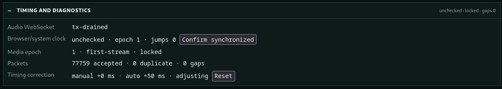

JS8 is slot-based, so a clock that is a second out decodes nothing. This section shows the
clock state — the summary reads `Clock unchecked` until it has been — with
**Confirm synchronized** to accept the current offset and **Reset** to start again.

The rest of the block reports the health of the modem, the audio channel and the link: decode
counts, buffer state and the last errors. It is the first place to look when something is
not working.

### 5.16 Frequency timetable

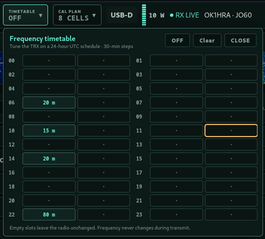

A 24-hour schedule of which band the station should be on, at half-hour resolution, wrapping
continuously around the day. Empty and active half-hours are coloured differently, and the
active or planned band is named on the button in the top bar.

| Control | Action |
|---|---|
| **OFF / ON** | arm or disarm the schedule |
| **Clear** | empty it |
| **CLOSE** | close the panel |

Click a cell to set the band for that half hour.

> **A scheduled change never happens during a transmission.** The band change waits for the
> transmission to finish.

### 5.17 Logging JS8 QSOs

**LOG QSO** in the TX SESSION header writes the contact to the log.

It also fires **by itself** as soon as a QSO is established — defined as a *bidirectional*
SNR exchange — including contacts made automatically while you were away. Both reports are
stored, yours sent and theirs received.

The target is a **dedicated permanent log**, not whichever log happens to be open in QRPLog:
one named `<date>-JS8CALL`, for example `2025-12-20-JS8CALL`, created on the first JS8 QSO.
The mode is logged as `JS8` — not the radio's `USB-D` — and no exchange is stored.

After logging, the button turns into **VIEW LOG** and opens the logbook in a new window.

### 5.18 Troubleshooting

| Symptom | Cause and fix |
|---|---|
| PTT works, no RF | the radio's `MOD Input` is not set to `WLAN`. See [section 5.1](#51-what-the-page-is). |
| *Loading JS8Call-ICOM modem 0 %* never moves | the modem worker did not start. Press **RETRY**; the page can otherwise look alive because the session and audio channel are up. |
| `TX prebuffer missed slot` on the first transmission after loading the page | start-up starvation; the next slot is normally fine. |
| `TX buffer underrun`, `TX packet identity/continuity failure` | the network is not keeping up with the audio stream. Move the tablet closer to the access point. |
| Everything stalls with the tablet far from the router | dropouts follow the *tablet's* distance from the access point, not the radio's link. |
| Nothing works on an Android phone hotspot | client isolation cannot be turned off on Android hotspots, and it breaks the audio path. Use a normal router. |
| The radio looks dead and the DXC page is open several times | **keep exactly one DXC window open.** The cluster WebSocket accepts a single client; extra windows fight over it in a reconnect storm that starves the radio's own connection. |
| `not calibrated for 20m @10% - using the manual 0.25` | that band and power pair has never been measured. Run **CAL PLAN**, or accept the manual gain. |
| The unattended countdown does not start after loading the page | toggle it off and on again. |

---

## 6. DATA — WSPR beacon

**`/wspr.html`** — the **WSPR-Beacon** tab of the DATA page.

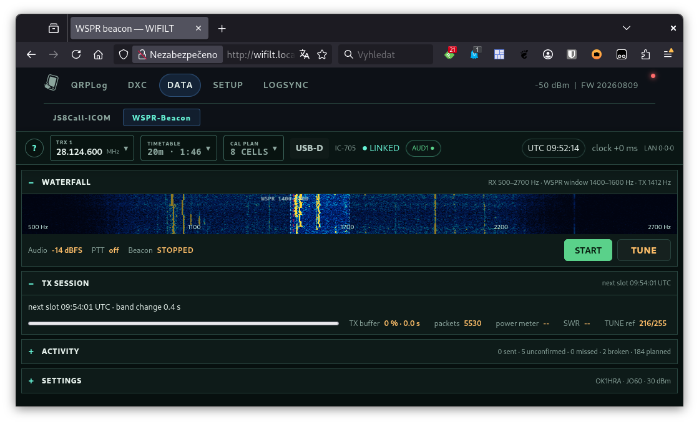

### 6.1 What the beacon does

WSPR transmits your callsign, locator and power in a two-minute frame at a few hundred
milliwatts, and receiving stations all over the world upload what they hear. It is how you
find out whether a band is open and whether an antenna works.

The beacon generates the audio in the browser, frame by frame, and sends it to the radio over
the same LAN audio path JS8 uses. Like the JS8 page it needs a radio on ICOM-LAN and refuses
to open without one, and like the JS8 page it holds a single-operator session — a second
browser is offered **TAKE THE SESSION OVER HERE** rather than being allowed to transmit in
parallel.

The two pages are deliberately built alike, section for section, so that moving between them
needs no re-orientation.

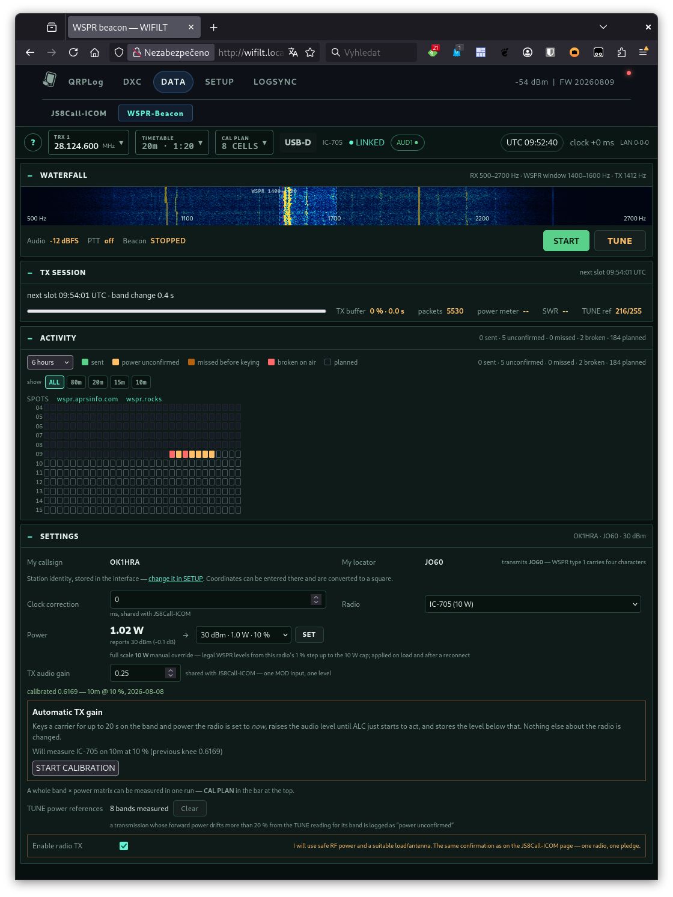

> **A compound callsign cannot be encoded.** WSPR type-1 messages have no room for it. If
> your callsign has a prefix or suffix, the beacon will tell you rather than transmit
> something wrong.

### 6.2 Starting and stopping

The top bar carries the same **`?`**, frequency, **TIMETABLE** and **CAL PLAN** controls as
the JS8 page ([section 5.2](#52-header-radio-frequency-power-session)), and three readouts of
its own:

| Readout | Meaning |
|---|---|
| **radio model** | the model the radio reported about itself |
| **AUD1** | the state of the audio channel to the radio |
| **LAN drop · stall · fill** | link health since the interface booted: dropped sessions, loop stalls, and retransmits answered with filler. **Shown only once one of them moves** — a clean link says nothing, because `LINKED` and `AUD1` already report it. Numbers climbing during transmission point at the network, not the radio. |

Beside the waterfall sit **PTT** and **Beacon** as a pair, deliberately not merged: *beacon
transmitting with PTT off* is a real failure mode, and one indicator could not show it.

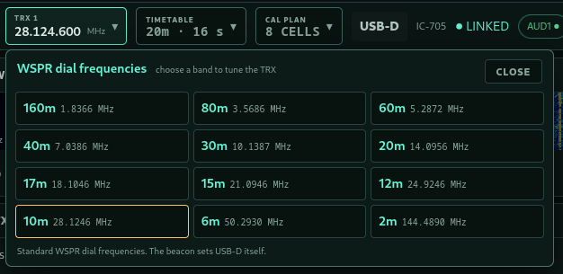

The frequency button opens the WSPR dial-frequency presets. Pick a band and the radio is
retuned.

**If the radio's frequency does not match one of the presets, the button is coloured and
START is disabled — but TUNE stays enabled.** You can always tune up; you cannot start a
beacon on a frequency that is not a WSPR frequency.

START refuses for several other reasons too, and it says which: an unknown radio model, power
reading zero, power above the 10 W ceiling, an invalid callsign or locator, and **an empty
time table**. On top of those come the conditions shared with the JS8 page — no ICOM-LAN
slot, the radio not answering, another page holding the session, the audio link not ready,
and the transmit pledge not accepted.

| Button | Action |
|---|---|
| **START** / **STOP** | arm and disarm the beacon |
| **TUNE** | key a carrier now, to check the antenna and set the power reference. It turns into **STOP** while the carrier is up. |

With **START** armed, a **green mm:ss counter** to the left counts down to the start of the
next transmission. Once transmitting it turns **red** and counts down to the end. **The whole
page is framed in red while transmitting**, the same convention JS8Call uses.

> **TUNE keys the transmitter and modulates it**, and it retunes the radio to do so. The
> countdown beside START shows the TUNE watchdog — the time until TUNE switches itself off.

### 6.3 Power

This is the part of the page most worth understanding, because WSPR reports your power to
the world and a wrong figure makes your spots meaningless.

**There is one power control, and the radio wins.** The row reads left to right: what the
radio currently reports, an arrow, and what you want it set to.

- **Turn the knob on the radio** and the reported value follows it, rounded to the nearest
  legal WSPR level.
- Or pick a level from the menu and press **SET** to write it to the radio.
- A **mismatch between what the radio reports and what you selected is highlighted** but
  never blocks transmission — and the collapsed section header carries that state too, so a
  folded section never lies about it.

The menu runs from **the radio's own 1 % step up to a hard 10 W ceiling**. The beacon
refuses to key above 10 W whatever the radio can do. What that means in practice:

| Radio | Usable menu range | Resulting power |
|---|---|---|
| 10 W radio (IC-705) | 1 – 100 % | 100 mW – 10 W |
| 20 W radio | 1 – 50 % | 0.2 W – 10 W |
| 100 W radio | 1 – 10 % | 1 W – 10 W |

Powers below the radio's 1 % step simply cannot be set — that is the smallest step the radio
has. **The default is 1 %.** Your choice is stored and re-applied automatically the next
time the page opens and after a reconnection, but never in the middle of a transmission.

### 6.4 Waterfall and TX SESSION

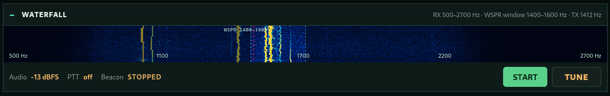

The waterfall shows 500–2700 Hz with the **WSPR window at 1400–1600 Hz** marked. It is
**read-only** — there is nothing to click, because the beacon chooses its own offset. The
audio channel is held open the whole time the page is loaded, which is why the display is
live before you ever press START.

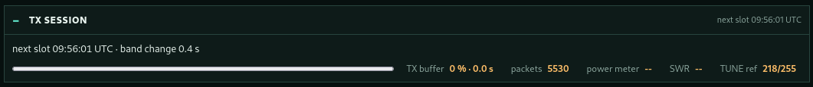

**TX SESSION** says what is happening now, or `no slot scheduled`. During a transmission it
shows:

| Meter | Meaning |
|---|---|
| **progress** | how far through the two-minute frame |
| **buffer ahead** | how much audio the radio still has queued, as a share of the firmware's 1.5 s transmit buffer. The browser deliberately runs ahead of the radio. **If this reaches zero the tone breaks** and the frame is logged `TX buffer underrun`. |
| **packets** | audio packets sent so far |
| **forward power** | the radio's own meter, where 255 is full deflection. An instrument reading, not watts — the scale is not linear. |
| **SWR** | as reported by the radio. Both this and forward power are only meaningful while keyed, and are blank on receive. |
| **TUNE reference** | what the power meter peaked at during the last TUNE on this band and power, on the same 0–255 scale |

The level bar empties on the switch back to receive and starts from zero each time.

### 6.5 Activity

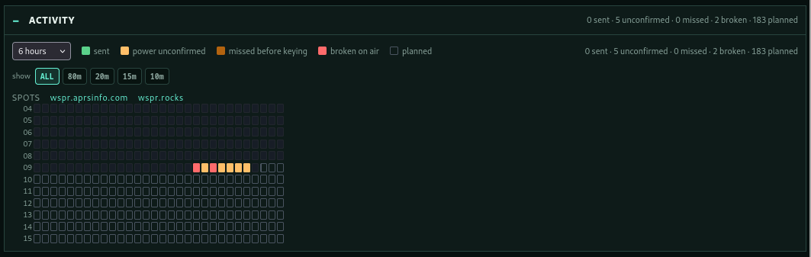

What the beacon has actually done, drawn as a grid of frames in the manner of a contribution
calendar.

| Colour | State |
|---|---|
| **sent** | transmitted and confirmed |
| **power unconfirmed** | transmitted, but forward power drifted more than 20 % from the TUNE reference for that band |
| **missed before keying** | the slot was scheduled but never keyed |
| **broken on air** | the transmission started and failed |
| **planned** | a future frame, drawn as a dark grey hollow frame |

The range selector offers **1 hour, 6 hours (default), 24 hours and 7 days**.

With bands rotating, one cell can hold several of them and **the worst status wins its
colour** — a single broken frame on 10 m would otherwise paint an hour in which 40 m and 30 m
were perfect. The band row above the grid narrows it to one band at a time, so a band that
never works can be seen never to work.

**Click any cell** to open its detail: every frame in that period with its slot, band, power,
audio offset, status and — for anything that did not go out cleanly — **the reason the
firmware gave**. It is the only place a per-frame failure reason is visible, and it is the
first thing to look at when the grid shows a colour you did not expect.

**SPOTS** links to <https://wspr.aprsinfo.com/> and <https://wspr.rocks/>, which is where you
find out who heard you. They open in a new tab and need internet — there is nothing to see
there when your browser is on the interface's own hotspot.

### 6.6 Time table

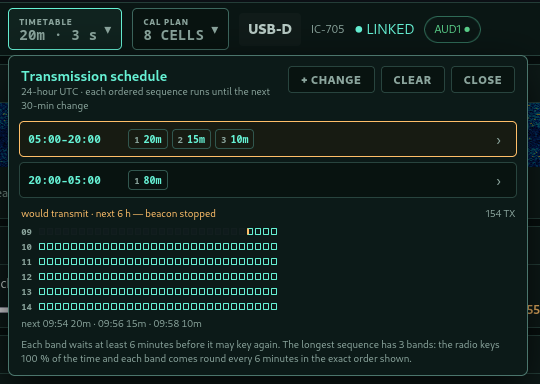

A 24-hour UTC schedule of which bands to beacon on. It is built from **sequence changes**: at
a 30-minute boundary you define an ordered list of bands, and that sequence runs until the
next change.

| Control | Action |
|---|---|
| **+ CHANGE** | add a sequence change on a 30-minute boundary |
| **UNDO** | undo the last edit |
| **CLEAR** | remove every change |
| **CLOSE** | close the panel |

Below the list, a **live preview** shows what the schedule will actually key at two-minute
resolution over the next six hours — because a table of sequences alone does not tell you
what will happen.

Two rules govern the pacing, and they are worth stating plainly:

- **The densest choice is every third frame.** There is deliberately no "every frame" or
  "every second frame" option, so a single WSPR frequency cannot be flooded.
- **Band rotation is the exception that preserves the rule.** With two or more bands the
  scheduler alternates them indefinitely, and with **three or more bands it may transmit
  continuously** — each frame on a different band, which still leaves two free slots per
  band.

Each band waits at least six minutes, and frequency and mode are confirmed between slots.

> **The beacon may slow itself down without being asked.** If three retunes in a row miss
> their deadline — the radio is answering too slowly to change band and settle before the
> frame starts — the scheduler begins leaving the frame after every band change empty. TX
> SESSION then reads `band change N.N s, pacing reduced`. It is protecting the transmission
> rather than keying one that would be cut short.

**Worked example — a day of band rotation**

| Change at | Sequence | What happens |
|---|---|---|
| `06:00` | 40 m, 30 m, 20 m | three bands rotating; a frame goes out every two minutes, each band every six |
| `10:00` | 20 m, 17 m, 15 m, 10 m | the daytime high bands; each band every eight minutes |
| `18:00` | 40 m, 80 m | two bands, alternating; each band every six minutes with a gap between |
| `23:00` | 160 m | one band, so every third frame — the pacing rule at its plainest |

### 6.7 SETTINGS

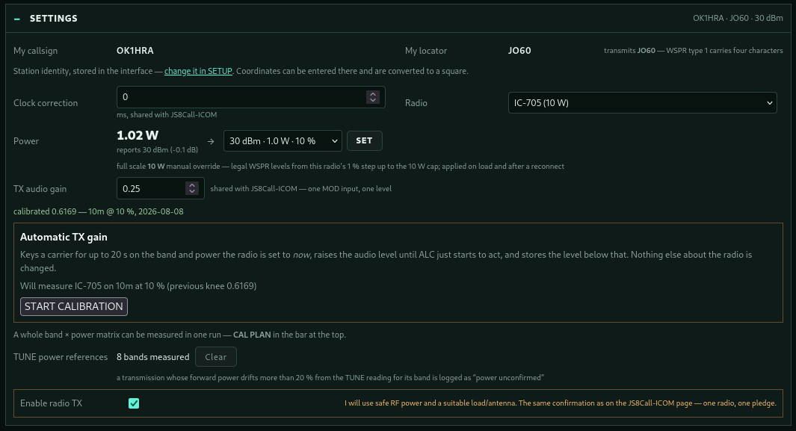

| Setting | Meaning |
|---|---|
| **My callsign** / **My locator** | shown, not editable — change them in SETUP. The line beside the locator says what will actually be transmitted: **WSPR type 1 carries four characters**, so `JO70FD` goes out as `JO70`. |
| **Clock correction** | milliseconds, **shared with the JS8Call-ICOM page** but stored per device |
| **Radio** | `auto (from the radio)`, or force a model when the radio cannot be asked |
| **Power** | see [section 6.3](#63-power) |
| **TX audio gain** | 0.1–0.8, **shared with JS8Call-ICOM** — one modulator input, one level. The measured value in force is shown beside the field rather than in it, because a calibrated level can be 0.006 or 0.63 and the field steps in 0.05. |
| **TUNE power references** | how many bands have a reference, and a **Clear** button. A transmission whose forward power drifts more than 20 % from its band's TUNE reading is logged *power unconfirmed*. |
| **Enable radio TX** | the same pledge as on the JS8 page — one radio, one confirmation — and settable from either page. |

### 6.8 TX audio gain and CAL PLAN

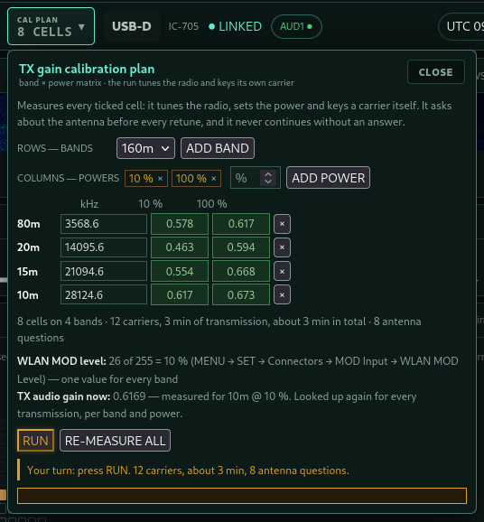

The problem this solves: too little audio and the signal is weak, too much and the ALC
compresses it into splatter. The right level is the highest one that does **not** move the
ALC, and it is different for every band and every power setting.

**The single-shot tool** sits in SETTINGS on both the JS8 and WSPR pages —
**START CALIBRATION**. It keys a carrier on the band and power the radio is set to *now*,
raises the audio until the ALC just begins to act, and stores the level for exactly that
band-and-power pair.

**CAL PLAN**, in the top bar, does the whole matrix in one run.

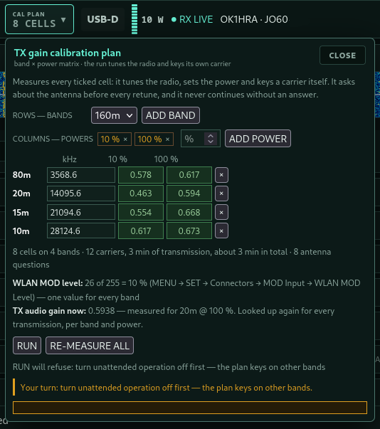

- Each **band is a row**, each **power a column**. **ADD BAND** and **ADD POWER** build the
  matrix; a power is a whole percentage of the radio's scale, and **four powers per band is
  the limit** — every column is another carrier on the air.
- Cells show their state: `EMPTY`, `NOT CALIBRATED`, `NOT FOR THIS BAND`, or the measured
  value.
- **RUN** starts. **RE-MEASURE ALL** discards what is stored and does it again. **STOP** ends
  the run.
- **Before every retune to a new band the tool stops and asks whether the right antenna is
  connected.** That is the reason the run is interactive at all — it is about to key a
  carrier. Answer **connected**, **skip this band**, or **stop**. A checkbox beside the
  question arms the same answer for all the remaining retunes, so you can walk away.
- If nobody answers the question within 30 minutes the run gives up and releases the radio.
- A band skipped while others finish is returned to, not abandoned.
- The **CAL PLAN button turns red by itself** when nothing is calibrated at all, or when the
  radio is sitting on a band that has never been measured.

The result is either a TX audio gain value or, where the audio path cannot reach the ALC at
all, a correction written to the radio's **MOD level** over CI-V.

> **This transmits.** Calibration keys a steady carrier at the power you set, repeatedly.
> Use an antenna you may legally transmit into, or a dummy load, and remember that a matrix
> of four bands × three powers is twelve carriers.

**Messages you may meet**

| Message | Meaning |
|---|---|
| `radio did not confirm the power` | the power change was not acknowledged; check the CI-V link |
| `carrier ran out before search finished` | the carrier ended before the knee was found; retry |
| `no knee found — ALC never acted, even at the maximum level` | check that the radio's MOD input is the LAN one, that its MOD level is not too low, and that RF power is not set higher than the audio path can drive |
| `not calibrated for 20m @10% - using the manual 0.25` | that pair was never measured; the manual gain is used instead |
| **Continue** seems not to react on the first press | the PTT frame is still lit although PTT is already released. It does no harm — wait for the frame to go out. |

### 6.9 Radio setup help

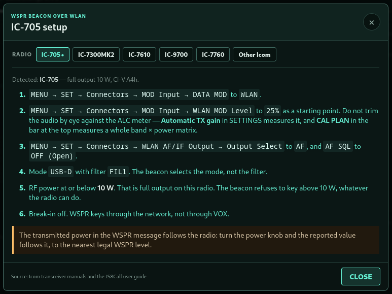

The **`?`** at the left of the radio bar — on both the JS8 and the WSPR page — opens the
setup instructions for your transceiver. The detected model is preselected, and the buttons
along the top switch to any of the others, including **Other Icom** for a model the software
does not recognise.

For an IC-705 it lists, with the exact menu paths:

1. `MENU → SET → Connectors → MOD Input → DATA MOD` to **`WLAN`**
2. `MENU → SET → Connectors → MOD Input → WLAN MOD Level` to **25 %** as a starting point —
   and explicitly *not* to trim the audio by eye against the ALC meter, because the automatic
   gain tool measures it properly
3. `MENU → SET → Connectors → WLAN AF/IF Output → Output Select` to `AF`, and `AF SQL` to
   `OFF (Open)`
4. Mode **USB-D** with filter `FIL1` — the beacon selects the mode, not the filter
5. RF power at or below **10 W**
6. Break-in off — WSPR keys through the network, not through VOX

The panel also restates the power rule: the transmitted power in the WSPR message follows the
radio, so turning the knob changes what is reported, to the nearest legal WSPR level.

---

## 7. DATA — Mercury file transfer

**`/mercury.html`** — the **Mercury** tab of the DATA page.

### 7.1 What Mercury does

Mercury is a point-to-point file transfer mode for HF: call a station, exchange a file, hang
up — half-duplex with a full ARQ handshake, not a one-way broadcast. It runs the real Mercury
v2 / HERMES modem ([section 12](#12-component-licences)), compiled to WebAssembly and driven
from a background Worker, over the same ICOM-LAN audio path (AUD1) as JS8Call and WSPR — the
page needs a radio on ICOM-LAN and refuses to open without one, the same gate as the other two
DATA tabs.

Unlike the JS8Call page, Mercury is built to be transactional — open it, call, send, close —
but the waterfall and an ambient listening role run for as long as the page stays open, the
same lease-holding pattern JS8Call and WSPR already use. Mercury's session lease is its own,
separate from the one JS8Call and WSPR share: opening Mercury does not disturb a JS8Call or
WSPR tab already using the radio, and the reverse holds too. Only one of the three, and only
one device, can actually hold the radio at a time — a second attempt gets a takeover offer
([section 7.7](#77-a-transfer-running-elsewhere)).

### 7.2 Header: radio, timetable and CAL PLAN

The frequency button opens Mercury's own dial-frequency presets — a separate catalogue from
JS8's calling channels, built on the Winlink ARDOP/VARA-HF gateway convention rather than
JS8's calling frequencies, since the two are different traffic that would otherwise collide on
every band a station runs both on.

**TIMETABLE** and **CAL PLAN** work exactly like their JS8-page counterparts
([section 5.2](#52-header-radio-frequency-power-session),
[section 5.16](#516-frequency-timetable),
[section 6.8](#68-tx-audio-gain-and-cal-plan)), with one behavioural difference and one
mechanical one:

- The timetable retunes the radio whenever Mercury is monitoring — LISTEN on or off — not
  only while transmitting, because band-hopping is exactly what an idle, listening station
  needs. A due change waits out an active CALL/LISTEN session and applies the instant it
  clears, rather than forcing a retune mid-handshake.
- CAL PLAN keys Mercury's own **DATAC1 burst** rather than a steady tone, because a level
  calibrated against a tone does not carry over to Mercury's real, far peakier waveform. The
  grid, the antenna-confirmation prompt, and RUN/STOP are otherwise identical.

The rest of the bar — radio model, **AUD1**, link state and **Reconnect** — reads the same as
the JS8 and WSPR pages. Mercury has no operator-set power percentage of its own in the header;
that readout is read-only, showing whatever the radio is set to. The power Mercury actually
writes on load lives in SETTINGS ([section 7.8](#78-settings)).

**LISTEN**, at the right of the bar, is the one header control the other two pages don't have.
With it on, this station may answer an incoming CALL unattended, and the indicator glows red —
the same "may transmit at any moment" convention as WSPR's TUNE and beacon lights — because
that is exactly what it means. With it off, Mercury cannot be reached, even with the page
open, but the waterfall and this station's own audio keep running regardless of LISTEN, from
the moment the page loads: you can always see whether the band and the audio path are alive
without exposing the station to an unattended CALL.

### 7.3 Waterfall

The same 500–2700 Hz display as JS8/WSPR ([section 5.3](#53-waterfall)), read-only — Mercury's
ARQ modem picks its own bandwidth, so there is no offset to click. It goes blank during this
station's own transmission, the same convention as the other two pages.

### 7.4 Calling a station, and CQ

Type the other station's callsign — `OK2XYZ` — into **Station callsign** and press **CALL**.
Mercury dials out and retries the CALL/ACCEPT handshake on its own, using the retry counts and
interval set in SETTINGS. Both CALL and an auto-answered incoming call need this station's own
callsign set in SETUP → Identity first, and both need an active session — LISTEN on, or a CALL
already under way — an idle, unarmed page cannot transmit at all.

**CQ** broadcasts this station's own callsign to anyone listening, sendable at any point a
call/listen session is running, including mid-transfer. It only says who is listening, not who
can be worked — hearing it still needs the other station tuned in and decoding. Replies appear
beside the button as they come in: `Heard: OK2XYZ (50 Hz)`, the number being the bandwidth of
the signal that was decoded. The list is cleared each time a new session starts.

### 7.5 Connection test and live status

Once a CALL is answered — or an incoming one accepted while LISTEN is on — **CONNECTION TEST**
reports what the handshake measured, once: the peer's callsign, the SNR each way, and the mode
Mercury picked for the link, e.g. `Connected with OK2XYZ · SNR RX +4 dB / TX +2 dB` /
`Recommended mode: DATAC3`.

A separate **STATUS** section appears only **while the connection is actually up**, and
disappears the moment it ends — nothing here is left showing a stale number. It carries the
same SNR reading kept live, both ends' current mode and that mode's nominal bit rate, and a
running count of clean versus retried frames for this connection — `Frames: 12 clean, 2 needed
a retry (86% clean)` — noting when few retries are left on the frame currently in flight.

### 7.6 Sending and receiving a file

Pick a **File**; Mercury shows its size immediately and, once connected, an estimate of how
long the send will take at the current mode's rate. **SEND** stays disabled until both a file
is chosen and the call is connected. A progress bar and running byte count track the transfer;
**CANCEL** stops it — which also ends the connection, since there is no partial-abort, and a
cancelled send or receive keeps only what already went across.

An incoming file needs nothing beyond LISTEN being on: it downloads automatically and, once
complete, appears as a link to save with its size beside it.

Two limits worth knowing: the **transfer size limit** set in SETTINGS (default 200 KiB, hard
cap 250 KiB — [section 7.8](#78-settings)), and that a cancelled or otherwise interrupted
receive keeps its partial bytes and can resume on a later reconnect with the same peer instead
of starting over.

### 7.7 A transfer running elsewhere

Opening Mercury on a second device while a transfer is already running elsewhere does not show
the generic "session busy" panel JS8/WSPR use — it names the file and its progress:

> **Mercury transfer "foto.jpg", 43% done, ~24 min remaining. Take over and cancel?**

**TAKE OVER AND CANCEL** ends that transfer and hands this device the radio.

### 7.8 SETTINGS

Everything here lives on the interface itself, not this browser — every device sees the same
values — and is picked up **only at the start of the next CALL or LISTEN session**, never
mid-transfer. The section locks while a session is already running.

| Setting | Meaning |
|---|---|
| **Power** | Mercury's own target transmit power, applied on page load and after a reconnect, same auto-apply convention as JS8/WSPR ([section 6.3](#63-power)) — but its own value, not shared with them, because different modes want different power. Leave it blank to leave this radio's power alone. |
| **CALL retries** / **ACCEPT retries** / **DATA retries** / **DISCONNECT retries** | how many times each step of the ARQ handshake retries before giving up. Defaults 4 / 4 / 10 / 2. |
| **CALL/ACCEPT interval** | seconds between retries of the CALL/ACCEPT handshake; `0` uses Mercury's own built-in table. |
| **Retry-downgrade threshold** | consecutive retries on one frame before Mercury forces the link down to a slower, more robust mode. Default 2. |
| **Mode ceiling** | the fastest mode this station will pick for its own transmissions — the peer can still answer on anything up to it. Default DATAC3. |
| **Transfer size limit** | the largest file this station will queue to send, in KiB. Default 200, hard cap 250 — Mercury's own session buffer cannot hold more regardless of this setting. |

**SAVE** writes the fields to the interface. **RESET TO DEFAULTS** loads the factory values
into the fields but does not save them until SAVE is pressed.

---

## 8. SETUP

**`/setup`**

The five guided steps are described in [chapter 2](#2-first-run). This chapter is the
reference for the sections themselves — the full editors that sit inside and below the
steps.

Each section carries a badge saying where its values live:

| Badge | Store | Survives a firmware update |
|---|---|---|
| `eeprom` | NVS on the interface | ✅ |
| `config` | the interface's own configuration partition | ✅ |
| `eeprom + config` | both | ✅ |
| `live` | nowhere — running state only | ❌ resets on restart |

Everything except the guided radio walk is applied by **Save & Restart** at the bottom. The
browser waits while the device reboots and comes back on its own.

### 8.1 WiFi

`eeprom` — two networks, SSID and password each.

At boot the device scans first and starts with whichever configured network is actually on
the air, strongest signal first. If that one refuses it alternates to the other; after four
failed attempts, or when neither network is on the air, it falls back to AP mode. AP mode is
otherwise reachable only from the USB-C serial console.

The handover screen, the QR code and what happens in AP mode are covered in
[section 2.2](#22-the-five-steps).

### 8.2 Identity

`eeprom` — **My callsign** (`OK1HRA`) and **My locator** (`JO70FD`).

This is the single source of truth. The DX cluster logs in with the callsign, JS8 transmits
it, WSPR encodes it, and the logbook stamps QSOs with it. The JS8 and WSPR pages show both
values but cannot change them.

### 8.3 Radio

`eeprom + config`

**Shared CI-V bus** — one setting for the whole physical serial bus: **USB and CI-V serial
baudrate**, `1200 / 2400 / 4800 / 9600 / 115200`. Every radio whose connection is CI-V uses
it, and so does the USB serial console.

Below that, three slots share one editor, selected with the **TRX1 / TRX2 / TRX3** tabs. Each
tab shows the slot's label, its transport and whether it is answering.

| Field | Meaning |
|---|---|
| **Label** | up to 10 characters; this is the name shown on the QRPLog buttons and in the band decoder |
| **Connection** | `ICOM-LAN`, `TRXNET` or `CI-V` |
| **Radio IP address** | for ICOM-LAN, with a **Scan** button that sweeps the network |
| **Network username** / **Network password** | the credentials you invented in the radio's Network Control menu |
| **CI-V address** | hex, e.g. `A4` for an IC-705 |
| **Peer NET_ID** | for TrxNet, the two-hex-digit identity of the peer device |
| **Test & identify radio** | log in once and read the model back |

TRX1 is always active; TRX2 and TRX3 have an enable checkbox.

> **ICOM-LAN may be used by only one slot.** The audio path and the single-operator lock
> belong to one radio. The form enforces it: once a slot is on ICOM-LAN, the option
> disappears from the others, and saving anyway is refused.

**Announce WiFi IP via CW on first connect** — when the interface first links to a full-CAT
radio, it reads its own IP address to you in Morse. This is **sidetone only, by design**: it
snapshots the radio's mode, break-in, AF and RF gain, forces break-in **off** and RF gain to
minimum, plays the address, and puts everything back. **It never transmits.** It ships
switched off, because an operator who has just been handed the address on screen did not ask
to hear it.

**RADIO CONFIG INCOMPLETE** appears beside the section title when a slot is half-configured.

### 8.4 DX Cluster

`eeprom`

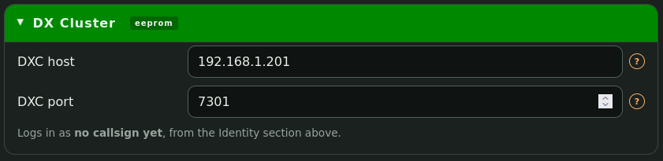

| Field | Meaning |
|---|---|
| **DXC host** | hostname or IP of the telnet server, e.g. `ve7cc.net` |
| **DXC port** | telnet port; commonly `7300` or `23` |

The section says which callsign it will log in with, taken from Identity. There is nothing
to type here — a second copy of the callsign is a second thing to get wrong.

### 8.5 TrxNet

`eeprom`

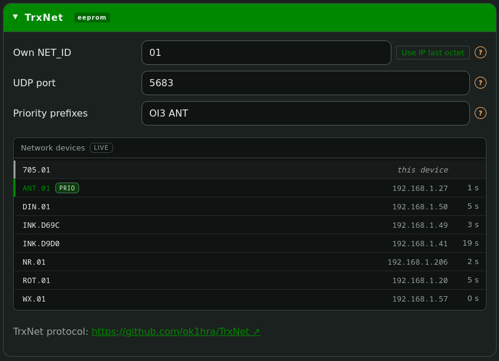

TrxNet is a peer-to-peer link between RemoteQTH devices on the same network.

| Field | Meaning |
|---|---|
| **Own NET_ID** | this device's identity, two hex digits. **`00` disables TrxNet.** Must be unique on the network. The device name is derived from it. **Use IP last octet** fills it from the address the device was given. |
| **UDP port** | discovery and CoAP port; every device on the network must use the same one. Default `5683`. |
| **Priority prefixes** | space-separated device-name prefixes kept in the peer table when it fills up. Default `OI3 ANT`; empty turns priority off. |

**Network devices** below lists the peers seen right now, live.

The protocol is documented in [docs/trxnet.md](docs/trxnet.md).

### 8.6 TX audio gain

`config`

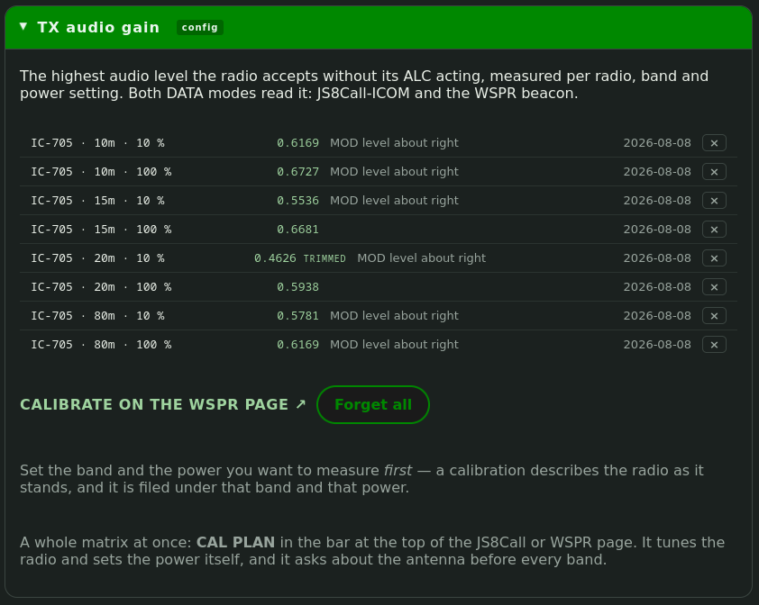

This section **shows** the measured ALC knees — per radio, band and power — and links to
where they are measured. It is hidden entirely unless some slot carries ICOM-LAN, because
without the network audio path there is nothing to calibrate.

| Control | Action |
|---|---|
| **CALIBRATE ON THE WSPR PAGE ↗** | opens the calibration; see [section 6.8](#68-tx-audio-gain-and-cal-plan) |
| **Forget all** | discard every stored calibration |

Set the band and the power you want to measure **first** — a calibration describes the radio
as it stands, and it is filed under that exact band and power. A whole matrix at once is what
**CAL PLAN** in the DATA page top bar is for.

### 8.7 LOG

`config`

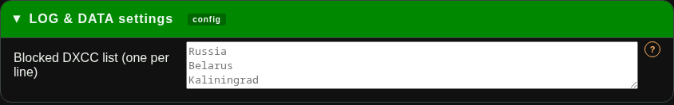

| Field | Meaning |
|---|---|
| **Blocked DXCC list** | DXCC entity names to exclude, one per line. The field carries a sample list to show the format. |

> This section used to carry three more fields — `RST default SSB/FM`, `RST default CW/RTTY`
> and `Manual mode for Phone`. They were saved and served, and nothing ever read them: the
> report prefill came from built-in defaults and phone was unconditionally manual. They were
> removed in REV 20260810 rather than wired up. A report is either the convention — `59` on
> phone, `599` on CW, RTTY and the data modes, read from the mode the radio reports and nothing
> to set — or it is what the operator types into the QSO form, and
> [§ 3.4](#34-working-a-station) covers that.

The blocked list has two different effects, which is worth knowing before you use it:

- In **QRPLog** a matching callsign is refused at logging time, with `⛔ BLOCKED: <country>`.
- On the **DATA page** those stations are **hidden entirely** — from the stations table, the
  traffic list, the map and every automatic function. They are discarded silently, with no
  error, and transmission to them is refused outright.

### 8.8 Remote management of JS8 unattended operation

`live`

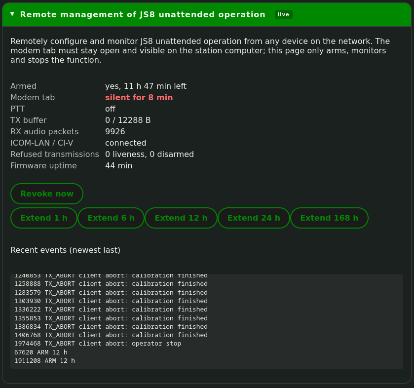

Arm, monitor and revoke JS8 unattended operation from any device on the network — a phone in
another room, or over a VPN from work.

It configures and watches; **it does not replace the modem tab**. The JS8 page must stay open
and visible on the station computer for anything to transmit at all.

| Element | Meaning |
|---|---|
| status grid | the current arming state, how long is left, and what the station is doing |
| **Revoke now** | disarm unattended operation immediately |
| extend | lengthen the arming window |
| **Recent events** | a log of what the unattended station has done, newest last |

Because this is running state and nothing else, it resets when the device restarts. That is
deliberate: a station should not come back from a power cut still armed.

### 8.9 Save, download and upload the configuration

**Save & Restart** at the bottom of the page writes everything and reboots.

Below that:

| Control | Action |
|---|---|
| **↓ Download config** | save the whole configuration as a JSON file |
| **↑ Upload config** | restore one |

Download a copy before any firmware update, and before any experiment you might want to
undo. When restoring a device from scratch, upload the file **first**, before setting
anything by hand.

The page footer links to the licence notices the device serves from its own filesystem.

---

## 9. LOGSYNC

**`/datasync`**

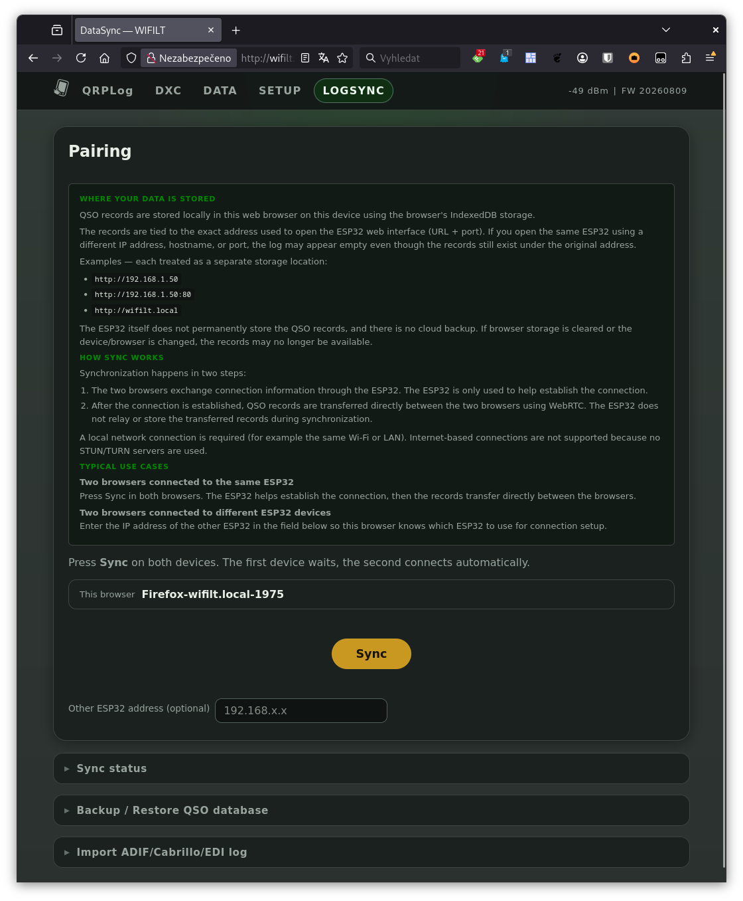

### 9.1 Where your QSOs live

QSO records are stored in **this browser, on this device**, in IndexedDB. The ESP32 does not
store them and there is no cloud backup.

> **The records are tied to the exact address you used to open the interface** — URL *and*
> port. `http://192.168.1.50`, `http://192.168.1.50:80` and `http://wifilt.local` are three
> separate storage locations to a browser. Open the same interface by a different name and
> the log will look empty although nothing was lost. Pick one address and stay with it.

If browser storage is cleared, or you change device or browser, the records may be gone for
good. Firefox is the most aggressive about this, which is why it gets a standing warning bar
with three remedies: bookmark the page (Firefox protects IndexedDB for bookmarked origins),
add a storage exception, or export a backup after each session.

### 9.2 Pairing and syncing

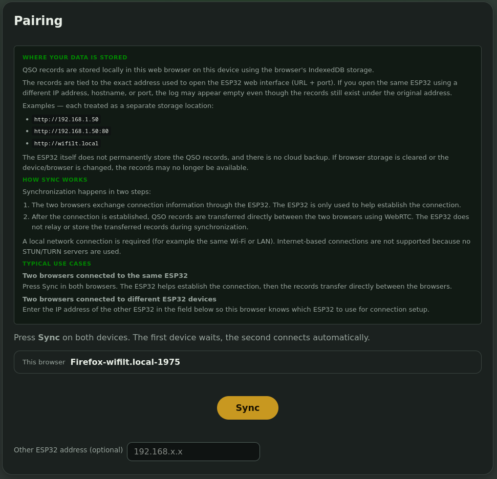

Synchronisation happens in two steps:

1. The two browsers exchange connection information **through the ESP32**. The ESP32 is only
   used to introduce them.
2. The QSO records then transfer **directly between the two browsers over WebRTC**. The
   interface neither relays nor stores anything during the transfer.

A local network connection is required — the same WiFi or LAN. Internet connections are not
supported, because no STUN or TURN servers are involved.

**Two browsers on the same interface:** press **Sync** in both. The first device waits, the
second connects automatically.

**Two browsers on different interfaces:** enter the address of the *other* ESP32 in
**Other ESP32 address** first, so this browser knows where to look.

While waiting, the page shows *Waiting for the other device…* with a **Cancel** button. On
the receiving side an offer appears naming who wants to sync, with **Accept** and
**Reject**.

### 9.3 Sync status

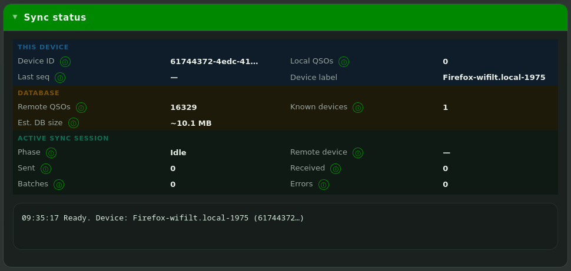

Every field has an **ⓘ** button explaining it.

| Field | Meaning |
|---|---|
| **Device ID** | this browser's identity in the sync mesh |
| **Local QSOs** | records held here |
| **Last seq** | the last sequence number this device issued |
| **Remote QSOs** | records held by the peer |
| **Known devices** | how many devices this database has met |
| **Est. DB size** | approximate storage used |
| **Phase** | where the current transfer has got to |
| **Remote device** | who is on the other end |
| **Sent** / **Received** | records moved in each direction |
| **Batches** | how many batches were exchanged |
| **Errors** | failures during the transfer |

> **"Done" means both directions finished.** A sync is only complete when the sending *and*
> the receiving halves are done, so a transfer still in progress will never claim to be
> finished — and a peer that cancels after a completed transfer does not turn it into a
> failure. It has been tested at 16 000 QSOs.

### 9.4 Backup and restore

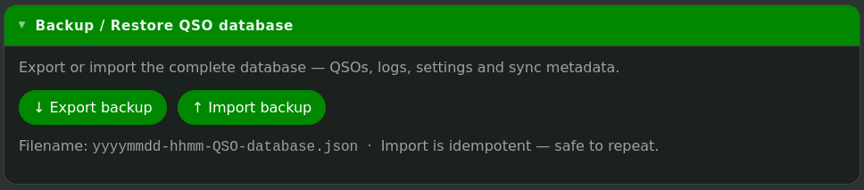

**Export backup** downloads the complete database — QSOs, logs, settings and sync metadata —
as a single JSON file. **Import backup** reads one back.

This is the only real protection for your log. Do it after each session.

### 9.5 Importing ADIF, Cabrillo and EDI

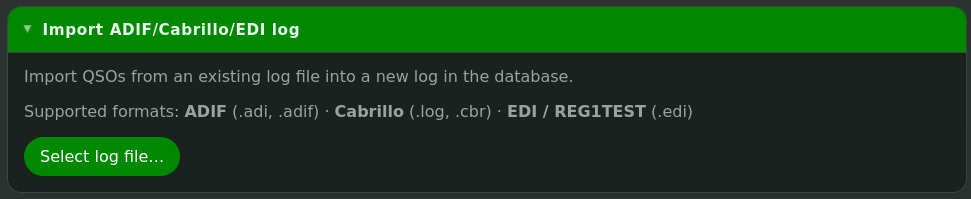

Bring QSOs from another logger into a **new log** in the database. Choose the file and press
**Import**; the format is detected automatically. Unrecognised files are refused with
*"Unknown format. Supported: ADIF, Cabrillo, EDI."*

The importer reports progress and finishes with **Done ✓**, or offers **Retry**.

---

## 10. BD — band decoder

**`/bd`**

The **BD** tab is hidden unless the interface is a RemoteQTH board of **hardware revision 04
or later**. On any other board, including a bare ESP32 module, the tab does not appear and
the page politely says the feature needs that hardware. Its absence is not a fault.

The band decoder switches physical outputs according to the radio's frequency — antenna
relays, amplifier band inputs, filter banks.

| Control | Meaning |
|---|---|
| **Freq source** | which radio drives the decoder: `TRX1`, and `TRX2` / `TRX3` when those slots have been given labels of their own |
| **Defaults** | restore the standard band plan |

The table has **16 rows**, each defining a frequency window and the outputs it asserts:

| Column | Meaning |
|---|---|
| **fMin (kHz)** | lower edge of the window |
| **fMax (kHz)** | upper edge |
| **OUTPUTS 1–16** | a checkbox per output; tick every output this band should assert |

Every row whose window contains the current frequency contributes, and their outputs are
**OR-ed together** — overlapping rows assert at the same time, which is how one frequency
can drive both a band relay and a shared filter. A row with `fMin` and `fMax` both zero is
unused.

The factory defaults are one row per band, each asserting a single output:

| Row | Range (kHz) | Output |
|---|---|---|
| 160 m | 1810 – 2000 | 1 |
| 80 m | 3500 – 3800 | 2 |
| 60 m | 5351 – 5367 | 3 |
| 40 m | 7000 – 7200 | 4 |
| 30 m | 10100 – 10150 | 5 |
| 20 m | 14000 – 14350 | 6 |
| 17 m | 18068 – 18168 | 7 |
| 15 m | 21000 – 21450 | 8 |
| 12 m | 24890 – 24990 | 9 |
| 10 m | 28000 – 29700 | 10 |
| 6 m | 50000 – 54000 | 11 |
| 4 m | 70000 – 70500 | 12 |
| 2 m | 144000 – 146000 | 13 |
| 70 cm | 430000 – 440000 | 14 |
| — | unused | — |
| — | unused | — |

Nothing has to be saved by hand: edits are written two seconds after you stop typing, and
the status beside the source selector says `Saving…` while it happens.

The current frequency is highlighted in the table, so you can see which row is active.

An external controller can read and write the same configuration over
`GET`/`POST /api/bd-config`.

---

## 11. Transmit safety

Several functions in WIFILT key the transmitter, some of them without you pressing anything
at that moment. They are gathered here so nothing is a surprise.

| Function | What it does on the air |
|---|---|
| **TX audio gain calibration** and **CAL PLAN** | keys a steady carrier, repeatedly, at the power you set — a matrix of four bands × three powers is twelve carriers |
| **WSPR beacon** | transmits a two-minute frame on the schedule you built, indefinitely |
| **JS8 heartbeats** | transmits a short frame on the heartbeat interval |
| **JS8 auto-reply** | answers other stations' queries by itself |
| **JS8 Repeat CQ** | calls CQ on an interval |
| **JS8 SEND LATER** | may transmit a deferred message at any time, without you present |
| **TUNE** on either DATA page | keys a modulated carrier until its watchdog stops it |
| **QRPLog macros** | key CW or RTTY when you press Enter |

Three things govern all of it:

1. **Enable radio TX** is the master switch, shared by the JS8 and WSPR pages and settable
   from either. With it off, none of the above can transmit and their indicators go grey. The
   tickbox carries the pledge *"I will use safe RF power and a suitable load/antenna."*
2. **Unattended operation needs a live browser.** There is no hard air-time cap — an
   automatic station has to be able to send a long message without being cut off — so instead
   the firmware requires a heartbeat from the page. Close the browser and transmission stops.
3. **The WSPR beacon will not key above 10 W**, whatever the radio is capable of.

And two that do *not* transmit, despite appearances:

- The **CW IP announcement** plays the address into the sidetone with break-in forced off
  and RF gain at minimum. It never keys the transmitter.
- The **APRS-IS gate** ([section 5.7](#57-aprs-is-gate-igate)) publishes other stations'
  traffic to the internet under your callsign. Nothing goes on the air, so *Enable radio TX*
  does not govern it and its marker stays lit when the master switch is off. What governs it
  instead is its own switch, a passcode that must match the callsign, and the four filters
  described in that section. It is the one automatic function here whose output is a
  network packet rather than a signal, and it is worth knowing that it carries **somebody
  else's words** under **your** callsign.

---

## 12. Component licences

WIFILT is free software under the **GNU General Public License, version 3 or later** — see
[LICENSE](LICENSE). This repository is the corresponding source for every binary the project
distributes, including the firmware and filesystem images served by the web installer.

The parts that came from elsewhere, with their own copyright and licence, are listed in
[data/THIRD-PARTY-NOTICES.txt](data/THIRD-PARTY-NOTICES.txt) — the same notice the device
serves from its own web UI, linked in the footer of the SETUP, JS8, WSPR and Mercury pages.

| Component | Origin | Licence |
|---|---|---|
| WIFILT's origin, per `wifilt.ino`'s own header | [IC705-BT-CIV](https://github.com/ok1cdj/IC705-BT-CIV) — OK1CDJ | GPL-3.0 |
| Icom LAN passcode and packet layouts in `icomLanClient.h` | [wfview](https://gitlab.com/eliggett/wfview/) — W6EL, M0VSE | GPL-3.0 |
| JS8 encoder and decoder (`data/js8-*.wasm`) | [JS8Call-improved](https://github.com/JS8Call-improved/JS8Call-improved) and its JS8/WSJT-X heritage | GPL-3.0 |
| WSPR protocol constants in `data/wspr-core.js` | WSJT-X — K1JT and the WSJT-X team | GPL-3.0 |
| Mercury ARQ engine, linked into `data/mercury-host.wasm`/`data/mercury-worker.js` | [Rhizomatica/mercury](https://github.com/Rhizomatica/mercury) — Rafael Diniz | GPL-3.0-or-later |
| FreeDV data modem, linked into the same Mercury WASM modules | [Codec 2 / FreeDV](https://github.com/drowe67/codec2) — David Rowe and contributors | LGPL-2.1 |
| FFTW 3.3.10, linked into `js8-decoder.wasm` | [fftw.org](https://fftw.org/); source vendored in `third_party/fftw/` | GPL-2.0-or-later |
| Eigen 3.4 | [libeigen/eigen](https://gitlab.com/libeigen/eigen) | MPL-2.0, plus BSD-3 and Apache-2.0 files |
| Boost 1.81 headers | [boost.org](https://www.boost.org/) | BSL-1.0 |
| Brotli decoder in `data/js8-brotli.wasm` | [google/brotli](https://github.com/google/brotli) | MIT |
| DXCC prefix engine in `data/dxcc.js` | DJ1YFK, with AD1C's `cty.dat` | GPL |
| Wake-lock media in `data/wake-lock.js` | [NoSleep.js](https://github.com/richtr/NoSleep.js) — Rich Tibbett | MIT |
| SETUP page's Wi-Fi QR code (`data/qrcode.min.js`) | [qrcodejs](https://github.com/davidshimjs/qrcodejs) — davidshimjs, after Kazuhiko Arase | MIT |
| `String` and other core classes vendored into the native (PC) build | ESP32 Arduino core — see `native/arduino/NOTICE.md` | LGPL-2.1-or-later, one file MIT |

Icom is a registered trademark of Icom Incorporated. WIFILT is an independent software
project and is not affiliated with, endorsed by, or sponsored by Icom Incorporated.

---

*Hardware: [HARDWARE.md](HARDWARE.md). Building from source: [BUILD.md](BUILD.md).*
